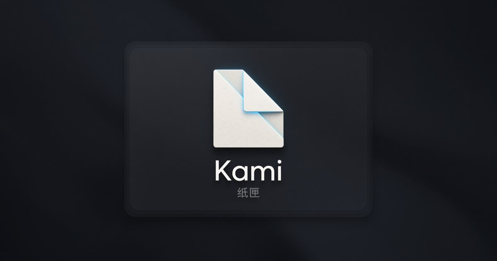

# Kami 纸匣

<p align="center">
  
</p>

<p align="center">
  
</p>

<p align="center">
  <a href="CHANGELOG.md"></a>
  = 22">
  
  
  
  
  
  <a href="LICENSE"></a>
  <a href="https://grok.com"></a>
</p>

**高速迭代中。** 功能和界面天天在改，这里不列清单。看变化去 [CHANGELOG.md](CHANGELOG.md)。

本项目仅供学习交流。个人备份，请尊重作者版权。

## 用法

需要 Node.js 22+ 和 [pnpm](https://pnpm.io)。

```bash
pnpm i
pnpm dev
```

打开 http://localhost:8080。Next.js App Router，端口 `8080`，绑 `0.0.0.0`。

```bash
pnpm build    # 生产构建
pnpm start    # 启动生产服务（同样 8080）
```

Docker：

```bash
docker compose up --build
```

同样是 http://localhost:8080。纸匣数据在 `kami-data` 卷（容器里的 `.data`）。

## 技术

壳是 **Next.js 15 App Router**（React 19、TypeScript 5.7、Tailwind 4）。没有 Vite / TanStack Start 退路。端口 `8080`，绑 `0.0.0.0`。生产镜像 `output: "standalone"`，容器里跑 `node server.js`。

站内跳转走 `kami-link`。浏览列表、详情、搜图用 TanStack Query。上游只打本站 `/api/source`、`/api/media`、`/api/social`，Cookie 留在服务端。

数据在跑 Next 的那台机器上，跟你从哪个 IP 打开无关：

| | 位置 | 说明 |
| --- | --- | --- |
| 纸匣目录 | `.data/vault/` | SQLite + 原图文件 |
| 封面缓存 | `.data/media/` | pximg / 图站图，7 天 |
| 列表缓存 | `.data/source/` | 日榜、图站、关注、推荐、FANBOX，30 分钟 |
| 用户文件夹 | 设置里选的目录 | 收入纸匣时优先写这里 |
| 浏览列表 | 浏览器 localStorage | 够一屏（约 50 张）；刷新先画浏览器，再问 Next |

浏览顺序：浏览器 → Next 服务端 → 源站。设置里可导出 / 导入本机设置、账号和纸匣目录（不含原图像素）。更细的落盘说明见 [docs/storage.md](docs/storage.md)。

## 鸣谢

- [yande-re-chinese-patch](https://github.com/zhzwz/yande-re-chinese-patch)
- [EhTagTranslation/Database](https://github.com/EhTagTranslation/Database)
- [PixEz](https://github.com/Notsfsssf/pixez-flutter)
- [Grok](https://grok.com)

## 许可证

[MIT](LICENSE)
