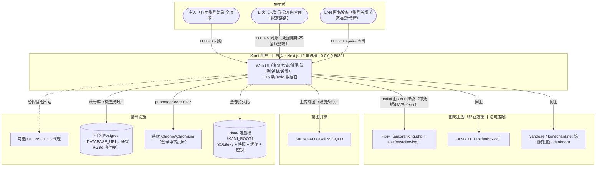
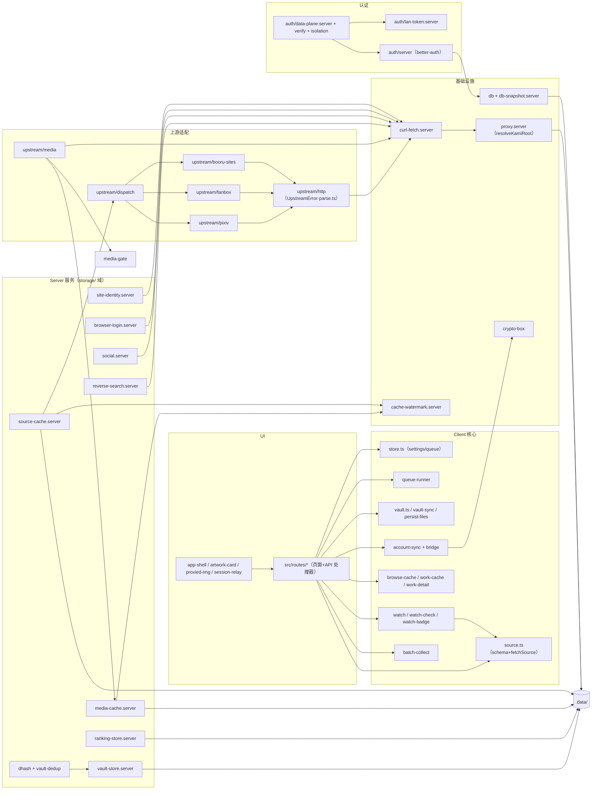

# 01 — 项目与架构说明

> 基线 `main@022c064`（2026-09-15 校准，含 #136~#149 路线与评审批、#150 统计页重设计+用户画像、#151~#152 纸匣智能库二期：画师名称整理+回顾三件套、#153 fake-ip 媒体守卫热修）。
> 本文由全量源码逆向分析生成并吸收历史文档精华（原 01-项目概述 / 03-系统架构设计 / 系统上下文图 / 系统架构图 / 模块关系图 已并入本文，原件已删除）。标记约定：**【需要确认】**=需维护者确认；**【基于源码推导】**=由代码结构推出、未经运行时验证。引用格式 `文件路径:行号` 对应本基线。

## 1.1 项目是什么

**Kami 纸匣**（`Atsukiizumi/Kami-paperbox`）是一台**跑在自己电脑上的图站中枢**：Next.js 服务端代替浏览器访问 Pixiv / FANBOX / yande.re / Konachan / Danbooru（带代理、带三层缓存、带凭据隔离），前端只跟本站通信；看中的作品经下载队列落入「纸匣」（用户文件夹优先，应用内目录兜底）；应用账号体系把设置与目录加密同步到服务端，换浏览器/设备不丢数据；未登录访客与 LAN 令牌形态各有独立访问面。

| 项 | 内容 | 依据 |
| --- | --- | --- |
| 项目类型 | 自托管单用户图站聚合 / 浏览 / 收集应用（BFF 架构 Web App） | 整体架构 |
| 品牌定位 | 日本纸工房审美（墨黑书案 + 宣纸），不是仪表盘、不是组件秀 | AGENTS.project.md |
| 主要用户 | ① 主人（应用账号登录，全功能）② 访客（应用账号开启但未登录，公开内容面）③ LAN 匿名设备（账号关闭形态，令牌配对） | data-plane.server.ts |
| 业务边界 | 仅供学习交流、个人备份；不破解付费墙、密码只打在官方登录页 | README、R-02 |
| 版本 | **0.10.3**（2026-09-15 发版，tag v0.10.3；Unreleased 现为空） | CHANGELOG.md |

**设计目标 vs 当前实现**：无存档 PRD，需求 = README + CHANGELOG + 代码本身【基于源码推导】。原设计的「服务端代访 + 凭据收敛」目标已 100% 落地；「单用户」假设正在被访客层温和扩展（访客可用公开内容面），但个人数据面仍严格单用户。

## 1.2 技术栈

| 类别 | 内容 | 版本（package.json 实测） |
| --- | --- | --- |
| 语言 | TypeScript 6.0.3（typecheck 走 **tsgo**——TS 7 原生预览编译器；eslint 侧保留 typescript 6 并轨） | ~6.0.3 |
| 框架 | Next.js 16.3.4（App Router、`output: "standalone"`）+ React 19.2 | ^16.3.4 / ^19.2.0 |
| UI | Tailwind CSS 4.3（@theme token、无配置文件）+ Radix UI 全家桶 + WAAPI/View Transitions 动效 + 自研瀑布流 | ^4.3.0 |
| 状态 | zustand 5（7 store，6 persist）+ TanStack Query 5.101 | src/lib/store.ts 等（vault-index/tag-lexicon/tag-catalog/watch-badge/view-history 分文件） |
| 校验 | zod 4.4（18 op 判别联合 + 各路由请求体） | ^4.4.0 |
| 数据库 | ① PGlite 0.5.4（内嵌 Postgres WASM，**纯内存实例 + JSON 快照持久化**）或 Postgres（pg 8.16，`DATABASE_URL` 设定时）② `node:sqlite` DatabaseSync ×2（vault、rankings）③ 文件系统 `.data/` | 三套并行 |
| ORM / 数据访问 | 自研 `Sql` tagged-template 接口；Better Auth 经 kysely 0.28.5 + 自研 PGlite 方言 | db.ts |
| 认证 | better-auth 1.7.4（邮箱密码单通道 + rateLimit 60s/20 次）+ 自研 LAN 令牌 + 图站会话 Cookie 三层体系 | src/lib/auth/* |
| 网络通信 | undici 8.10 连接池（16 连接，3 败熔断 10 分钟）→ curl 子进程降级；媒体全链路 signal | curl-fetch.server.ts |
| 特殊依赖 | puppeteer-core 25.9（登录中转投屏）、fflate（ugoira 解帧 + 导出 zip 流）、gifenc（GIF 编码）、jpeg-js/pngjs（dHash 解码）、react-day-picker（日历）、vaul（底部抽屉）、lxgw-wenkai-webfont（手绘风标题，分片按需）、pino 10.3（结构化日志，.server 层唯一日志通道） | package.json |
| 运行环境 | Node ≥22（engines 下限；CI 与 Docker 已升 **Node 24 = Active LTS**，开发机同版本）、pnpm 10.15.1 | engines、ci.yml、Dockerfile |
| 部署 | 本机 `pnpm dev / build+start`；Docker（node:24-bookworm-slim 两阶段 + compose 卷）；LAN 令牌形态；Vercel 已实质废弃 | Dockerfile |

**已知依赖风险**：`node:sqlite` 实验性 API、tsgo 原生预览编译器、PGlite WASM 实例强杀可能损坏目录（故纯内存 + 快照规避）——组合属前沿技术栈（R-11）。

## 1.3 项目结构

```text
kami-paperbox/
├── app/                    # Next.js App Router 薄壳层
│   ├── api/*/route.ts      #   15 条业务 API 路由路径（12 顶层 + vault/dedup、vault/stats/storage、vault/export；另有 /api/auth/[...all] 收敛 better-auth）
│   ├── */page.tsx          #   14 个页面壳（含 watch、vault/stats、vault/report）：re-export src/routes/* 实现
│   ├── layout.tsx          #   唯一 server 组件（文档骨架 + 主题防 FOUC 内联脚本）
│   └── providers.tsx       #   Provider 嵌套树（Auth > Query > Theme > Tooltip > 壳组件）
├── src/
│   ├── routes/             # 页面与 API 处理器真实实现（TanStack 风格命名，含 vault-stats/vault-report）
│   │   └── api/            #   13 个 API 处理器（zod 校验、502/400 错误分类；account/sync 与 vault/stats/storage 两条内联在壳层）
│   ├── components/         # 43 个顶层组件 + settings/ 分区组件 10（9 分区 + 画师名称整理）+ stats/ 统计组件 7 + ui/* 基件 22（app-shell/masonry-board/artwork-card/settings/*…）
│   ├── lib/                # 全部业务与基础设施（116 文件，.server.ts 后缀 = 服务端专属）
│   │   ├── upstream/       #   上游适配层（pixiv/fanbox/booru-sites/media/dispatch/http）
│   │   ├── auth/           #   better-auth 配置 + PGlite 方言 + LAN 令牌 + 数据面闸
│   │   ├── storage/        #   vault*/media-cache/source-cache/db*/ranking*/crypto-box/dhash...（M10 分域）
│   │   ├── sync/           #   account-sync/cred-tag/session-cookies/browser-login*/lan-pairing（M10 分域）
│   │   └── （平铺）        #   其余 = ui-support 域：masonry/watch/queue/tag-*/theme/parse...（既定形态）
│   └── styles.css          # Tailwind v4 @theme token + 5 主题 × 明暗 + 动效 keyframes + 纸感层（三级纸影/全局噪点/卷轴滚动条/手绘工具类）
├── migrations/             # 0001 auth → 0002/0003 同步分段 → 0004 exported_at 统一 bigint；auth/ 为 opt-in 模板
├── scripts/                # 工具脚本（环境包装/迁移/fixtures 抓取/e2e server/QA×4）+ 4 个单测文件
├── e2e/                    # Playwright 五条规格（关键路径/浏览缓存/访客层/relay-401/多设备同步）
├── data/booru-database/    # 标签库源数据（1,104 条 en→zh，构建用，保留追踪）
├── docs/                   # 本套工程文档（本地维护，不入库）+ 专题文档
├── .github/workflows/ci.yml# CI：verify(四门禁) + docker + e2e
├── Dockerfile / docker-compose.yml / kami.config.json（本地）
└── .data/（运行时生成）    # 一切持久化落盘根（KAMI_ROOT 解析）
```

`.data/` 运行时布局：`auth-secret.json`、`kami-db-snapshot.json`（+`.restore-failed.json` 隔离文件）、`lan-token.json`、`proxy.json`、`media/`（封面盘缓存 7d）、`source/`（列表缓存 30min）、`vault/`（vault.sqlite + files/）、`rankings/rankings.sqlite`。

## 1.4 系统上下文



**图解**：三类使用者走同一入口；一切上游访问由服务端代劳（凭据/代理/反爬收敛在服务端）；持久化全部落在 KAMI_ROOT 的 `.data/`（或外接 Postgres）。访客与 LAN 形态的差异只在数据面闸的放行策略。

**风险点**：① 上游全部是非官方接口，反爬升级即断（R-01）；② 默认绑 0.0.0.0，威胁模型必须包含不可信 LAN 设备；③ 登录中转依赖系统浏览器存在；④ PGlite 形态的持久化依赖快照文件（强杀丢 0.5-30s 窗口）。

## 1.5 系统架构

**自研变体：薄壳路由 + 分域模块库的 BFF 单体**。不是教科书分层架构，也不是微服务；准确描述为：

1. **BFF（Backend-For-Frontend）单体**：浏览器只与本站通信；服务端代替浏览器访问全部上游（凭据、代理、UA、Referer 都在服务端收敛）。单一 Next.js 进程承载 UI 与 API。
2. **薄壳双层路由**：`app/**` 全部是 5-7 行 re-export 壳（页面壳 → `src/routes/*` 实现；路由壳 → `src/routes/api/*` + withDataPlane 包装），是 TanStack Start → Next.js 迁移的产物，换来「路由契约集中在 src/routes、框架可替换」。
3. **客户端重心（client-heavy）**：除 layout 外全部 'use client'；无数据获取型 server component；数据经 React Query 打 /api/*。服务端职责是**代理与存储**而非渲染。
4. **事件/响应式混合**：无消息队列；进程内单例（inflightMedia、登录 job、queue）+ 广播（BroadcastChannel 跨标签）+ 惰性触发（水位扫描、缓存 TTL）。

不适用 DDD/Clean Architecture 判词：领域逻辑（映射/过滤/策略）以**纯函数分域模块**组织（同文件 .test.ts 就地测试），这是该项目可维护性的真实来源，属合理取舍。

### 分层分析

| 层 | 位置 | 内容与边界 |
| --- | --- | --- |
| UI / Presentation | src/routes/*、src/components/* | 页面 14 + 组件（顶层 43 / settings 分区 10 / stats 7 / ui 基件 22）；ProxiedImg/artwork-card/app-shell 为枢纽 |
| Client Application | src/lib（非 .server） | source.ts（数据入口）、store.ts、browse-cache、queue-runner、account-sync 等 |
| API / Interface | app/api + src/routes/api | 13 处理器 + 2 内联 / 15 业务路径；zod 判别联合校验；withDataPlane 横切闸 |
| Server Application | upstream/*、social.server、reverse-search.server 等 | 站点适配、缓存编排、限流 |
| Domain（纯函数） | pixiv-feed/search/profile、booru、social、ranking-archive、queue-retry、masonry-flow、page-flip 等 | 无 IO，单测覆盖主体 |
| Infrastructure | curl-fetch、proxy.server、db.ts、db-snapshot、media/source-cache、cache-watermark | 出站通道、存储、治理 |
| Database | PGlite/Postgres（账号+同步）、SQLite ×2（vault/rankings）、文件系统 .data | 三套并行存储 |
| External Integration | upstream/pixiv·fanbox·booru-sites、reverse-search.server、browser-login.server | 非官方接口逆向适配 |

**依赖方向总体单向**（UI → client lib → API → server lib → infra → storage），反向依赖基本没有；`app-shell.tsx` 对首页已改 next/dynamic 拆包（PER-13 ✅，PR #119），单向性恢复。

### 横切机制

| 机制 | 实现 | 评价 |
| --- | --- | --- |
| 认证/授权 | withDataPlane：Fetch-Metadata 同站校验 → 会话（better-auth）/ 访客 guest 标记 / LAN 令牌三态；auth/* rateLimit 60s/20 次 | 12 路由全接线（含 account/sync，无例外；auth/* 走 better-auth 自身） |
| 校验 | zod 4 判别联合（18 op fetchSchema、socialSchema、vault key、上传 multipart） | 边界全覆盖；whoami 无 zod（仅类型收窄，唯一缺口） |
| 错误分类 | classifySourceError：UpstreamError→502 / 其余→400（S7） | 客户端只读 message，分类供可观测性 |
| 缓存 | 三层：localStorage browse-cache(24h) → React Query(staleTime 30min) → 服务端 unstable_cache(1800s) + .data/source(30min) + .data/media(7d) | 强；TTL 已抽单一常量（TD-27 ✅ PR #119） |
| 限流/并发 | 服务端 media-gate(≤32 夹 1..32，默认 6) + 浏览器 media-lane(4) + 搜图引擎间隔预约 | 双层闸设计好；JSON 出站已统一 AbortSignal.timeout(45s)（TD-28 ✅） |
| 可观测性 | pino 结构化日志（默认一行人类可读，`KAMI_LOG_FORMAT=json` 切 JSON；`.server` 层 console 口径已清零）+ 请求 id 贯穿（AsyncLocalStorage，响应头 `X-Request-Id` 对账）+ 上游健康环形缓冲（设置→说明卡片 / `GET /api/health/upstream`） | 无集中收集（长期项，#146） |
| 动效 | src/lib/motion.ts FLIP + View Transitions 主题揭示 + IntersectionObserver 进视口渐入；全部响应 prefers-reduced-motion；合成线程优先（transform/opacity only） | #134 动效批落定基线 |
| 环境与配置 | kami.config.json（host/port/proxy/throttle/水位）mtime 热读 + VITE_* 构建期注入 + env；Next16 dev 需 allowedDevOrigins（已配 127.0.0.1/localhost/[::1]/LAN IP） | LAN IP 属本机特定值，DHCP 变化需跟补【需要确认部署机】 |

## 1.6 核心模块

| 模块 | 主要职责 | 核心入口 | 数据 | 外部依赖 |
| --- | --- | --- | --- | --- |
| 上游适配（upstream/） | 5 站点 17 种 op 的抓取与映射 | upstream/dispatch.ts `dispatchFetch` | — | pixiv/fanbox/booru-sites/http |
| 媒体代理管线 | 图片代理：白名单校验、盘缓存、单飞、流式上限 | upstream/media.ts `fetchMediaResponse` | .data/media | media-cache、media-gate、curl-fetch |
| 出站通道 | undici 池 → curl 降级、代理选择与探测 | curl-fetch.server.ts `outboundFetch` | proxy.json | proxy.server |
| 会话与凭据 | 图站 Cookie 解析/请求头组装/身份探测 | browser-login.ts、site-identity.server.ts | HttpOnly 镜像 cookie ×3 | — |
| 登录中转 | 无头 Chrome 投屏登录 Pixiv/FANBOX | browser-login.server.ts | — | puppeteer-core |
| 应用账号与访问闸 | better-auth、会话校验、访客层、LAN 令牌 | auth/server.ts、auth/data-plane.server.ts | PGlite 4 表 | db、verify.server |
| 账号同步与加密 | 四段 LWW 同步、KEK 信封加密 | sync/account-sync.ts、crypto-box.ts | user_sync_* 3 表 | backup-client |
| 备份 | v1 明文 / v2 口令加密导出导入 | storage/backup.ts、backup-client.ts | JSON 文件 | crypto-box |
| 纸匣存储（vault） | 收藏库：SQLite+文件双写、原子协议、查询 | storage/vault-store.server.ts、vault.ts | vault.sqlite 4 表 + files/ | persist-files |
| 纸匣查重与统计 | dHash 感知哈希、并查集聚类、存储聚合 | storage/dhash.ts、vault-dedup.ts | vault_hash / vault_dup_dismissed | vault-store |
| 画师更新追踪 | 追踪列表、水位 diff、关注导入、红点 | watch.ts、watch-check.ts、watch-badge.ts | 设置段（无新表） | source |
| 下载队列 | 并发/退避重试/Web Locks 单执行者 | queue-runner.ts、queue-retry.ts | localStorage kami-queue | save-work |
| 榜单归档 | booru 榜快照 SQLite 存储（每 (site,period) 保留最近 KEEP_PERIODS 期） | storage/ranking-store.server.ts | rankings.sqlite | ranking-archive |
| 反向搜索 | 三引擎上传搜图 + 限流守卫 | reverse-search.server.ts | — | 三引擎 |
| 缓存体系 | 三层缓存 + 水位治理 | browse-cache.ts、storage/source-cache.server.ts、cache-watermark.server.ts | .data/source、localStorage | media-cache |
| 双数据库架构 | PGlite/Postgres 选择、迁移、JSON 快照持久化 | storage/db.ts、db-snapshot.server.ts | 快照 JSON | migrate.mjs |
| 前端壳与状态 | AppShell 布局、7 store（2 在 store.ts，5 分文件）、React Query 约定 | app-shell.tsx、store.ts | localStorage（键位清单见 03 号 3.3 E） | 全部 client lib |
| 瀑布流渲染 | Flickr 式按行等高铺满 + 窄容器单列满宽分支 + CSS 兜底 | masonry-board.tsx、masonry-flow.ts | — | card-aspect |
| 主题系统 | 5 主题 × 明暗 + 界面风格两态（uiStyle: clean\|hand，#139）、防 FOUC、View Transitions 圆形揭示 | theme.ts、theme-provider.tsx、settings/appearance.tsx | localStorage | styles.css |
| 可观测性 | 服务端日志、请求 id、上游健康统计 | log.server.ts、request-context.server.ts、upstream/health.server.ts | 内存环形（每 host 50 条） | pino |
| ugoira 动图 | zip 解帧 → canvas → GIF 编码 | ugoira.ts、ugoira-player.tsx | — | ugoira-zip/meta |
| 标签体系 | 词表三级合并、联想、过滤 | tag-lexicon.ts、tag-suggest.ts | localStorage | tag-database/catalog |

**修改注意（按模块）**：新增 op 必须同时动 fetchSchema/dispatch/返回联合（never 穷尽检查会拦）；booru 改动跑 mapping.test.ts 固定样本；放宽媒体白名单前必须先修 isPrivateIp（SEC-08）；put 协议崩溃安全论证在 vault-store.server.ts:202-300 注释；凭据不变量写在 account-sync.ts 头注释；guest 标记改动必须同步 e2e/guest-tier.spec.ts。

### 模块关系（主干）



**三个高扇入枢纽**：`curl-fetch.server`（所有出站的物理层）、`proxy.server`（resolveKamiRoot 是全部 .data 落盘的定位基准）、`source.ts`（浏览器侧唯一数据入口）。上游适配层闭环在 upstream/ 内；认证层独立成岛只被 API 层消费。

## 1.7 并发与异步模型

| 面 | 模型 | 风险现状 |
| --- | --- | --- |
| 服务端请求 | Node 单进程事件循环；无 worker | 单用户定位下成立；多实例会快照互踩（R-12【需要确认是否恒单进程】） |
| 出站 | undici 连接池（connections 16）+ curl 子进程降级；3 败熔断 10min；JSON 路统一 45s 超时（TD-28 ✅） | 池实例挂 globalThis 防重复 |
| 媒体单飞 | inflightMedia 键 = URL + 账号指纹（TD-40 ✅），同账号并发合并 | abort 语义不变 |
| 登录 job | 进程内单例 + 4 分钟超时 + 凭据一次性消费 | 并发开两个中转会互相顶替【基于源码推导】 |
| 队列 | 浏览器侧：Web Locks 唯一执行者 + BroadcastChannel 镜像；并发 1-4 | 重试策略纯函数化（queue-retry.test.ts） |
| 定时/防抖 | 快照 dump 500ms 防抖 + 30s 看护；水位每 50 写扫；联想 200ms；同步推送 4s | sweepCache 已分批 yield（PER-11 ✅ PR #120） |
| Abort | 媒体链路全链路尊重 signal（abort→204）；JSON 链已统一 45s | — |
| 竞态防护 | globalThis promise 槽（db HMR）、请求令牌（vault/rankings 页）、水合门（SSR） | TD-23/38 类键漂移由 RTL 组件测试 + queryKey lint 防线（M9 ✅） |

## 1.8 架构质量

**优点**
1. BFF 单漏斗：凭据/代理/反爬对抗全部收敛服务端，前端零直连——整个产品的安全与性能故事都建立在这一个决策上。
2. 薄壳迁移层：框架契约（KNOWN_ROUTE_PATHS、kami-link 适配器）集中，二次迁移成本已被证明可控（TanStack→Next）。
3. 三层缓存 + 双层并发闸 + 单飞：对「图站聚合」这一 IO 密集场景的工程化相当到位。
4. 判别联合穷尽检查：新增 op/站点编译期强制覆盖全链路。
5. 存储分型清晰：账号（PG）、收藏（SQLite+文件）、缓存（文件）、会话性数据（浏览器）各得其所。

**问题**
1. `src/lib` 仍有平铺区（ui-support 域，watch/masonry/tag 等约 80 文件），仅 upstream/auth/storage/sync 有目录；eslint 双边界（M10）已拦 server 误引与反向依赖，但域内横向依赖仍靠自觉。
2. ~~巨文件集中在 UI 层~~ #147 已拆：settings 900→300（九分区子组件 `settings/*`）、artwork-card 637→305（交互 hook + 托盘/题注/栅格）；index.tsx 769 行成为最大单体（见 05 号 UI-BIG 尾项）。
3. 三套存储的一致性全靠应用层（无跨库事务）；LWW 无版本向量。
4. 动效批后 masonry 常量三处同步约束仍存（TS/CSS 变量/minmax 字面量）。

**风险**：上游反爬升级是架构级外部风险（R-01）；单维护者巴士因子 1（R-03）。
