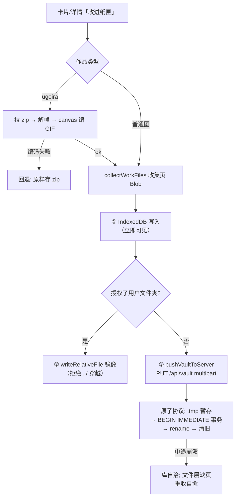
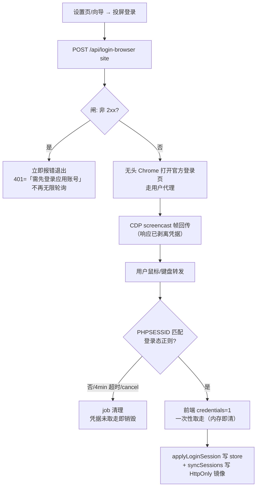
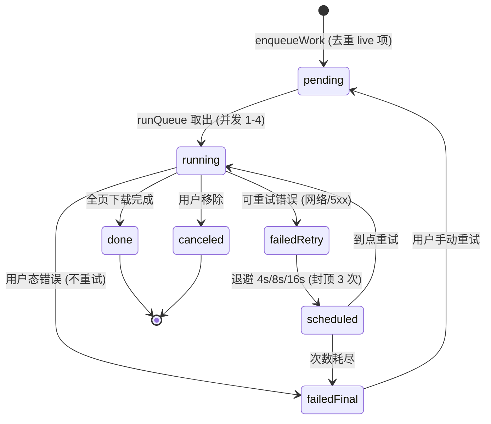
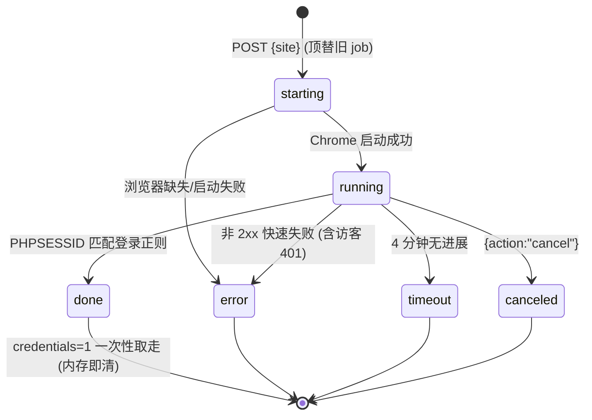
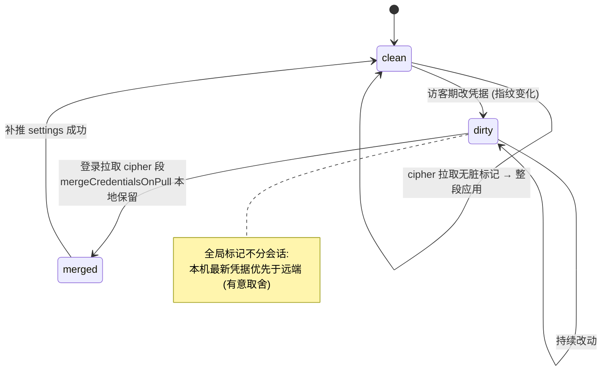

# 02 — 业务与接口设计

> 基线 `main@022c064`（2026-09-15 校准，含 #136~#153）。吸收原 02-需求规格说明 / 04-业务流程说明 / 07-接口设计说明 / 核心业务流程图 / 时序图 / 状态图 / upstream.md / pixiv-auth.md 精华（编号原件已删除；upstream/pixiv-auth 保留为专题文档）。本项目无需求文档存档，功能清单从代码、页面、接口与数据库反向还原。

## 2.1 业务角色

| 角色 | 形态 | 能做什么 | 依据 |
| --- | --- | --- | --- |
| 主人（登录用户） | 应用账号开启（默认）且已登录 | 全部功能：个人面（纸匣读写、会话绑定、登录中转、账号同步、导出）+ 公开内容面 | data-plane.server.ts |
| 访客 | 应用账号开启但未登录 | 公开内容面：浏览/榜单/搜图数据（/api/source）、图片（/api/media）、社交操作、反向搜索、榜单只读、**绑定链路三路由**（login-browser/sessions/whoami）；凭据由浏览器随请求体自带，不落服务端 | next-route.ts、e2e/guest-tier.spec.ts |
| LAN 匿名设备 | 账号关闭形态（`VITE_AUTH_ENABLED=false`） | 凭 24 字节配对令牌访问全部数据面（三通道：header / ?token= / cookie） | lan-token.server.ts |

图站账号（Pixiv/FANBOX/Danbooru）不是系统角色，而是主人/访客随身携带的**凭据**（访客存 localStorage + 请求体；主人另有 HttpOnly 镜像 cookie）。

## 2.2 功能清单（28 项，全部已实现）

| 编号 | 功能 | 角色 | 入口 | 核心逻辑 | 验证 |
| --- | --- | --- | --- | --- | --- |
| F-01 | 多源浏览（瀑布流） | 全部 | `/` | 三源 feed：Pixiv 8 榜单 mode + 推荐 + 关注、FANBOX 主页/赞助/创作者、Booru recent/hot/日周月榜；本地 50/页分页 + 无限补页；过滤前翻页判定；**手机 <480px 单列满宽**（#133：高度随原始长宽比，clampAspect 0.45~3.2） | 单测+e2e |
| F-02 | 搜索 | 全部 | `/`、搜索框 | 文本搜索（Pixiv filter 模型 safe/ai/排序/日期、booru 标签规范）+ 联想（本地+远端 200ms 防抖）+ 保存标签 | 单测 |
| F-03 | 以图搜图 | 全部 | `/search` | 客户端缩图（768px/q0.82）→ 三引擎并发或单发，结果回链本站作品；引擎限流间隔 + 验证页识别 | 单测 |
| F-04 | 作品详情 | 全部 | `/work/$source/$id` | 多页图/附件/动图 meta、相关推荐、社交状态、ugoira 播放；**多 P 预览滚轮切页**（#132：deltaY 阈值 8 + 时间锁 140ms + 循环取模） | 单测 5 例 |
| F-05 | 社交操作 | 携凭据者 | 卡片/详情 | Pixiv 点赞/收藏/关注（CSRF token 缓存 + 失效重取）、FANBOX 点赞/关注；乐观更新（TD-23 死键已修 + RTL 回归） | 单测+组件测试 |
| F-06 | 收入纸匣 | 主人/凭据者 | 卡片悬停/详情 | collectWorkFiles（含 ugoira→GIF 合成，失败回退存 zip）→ IndexedDB 立即可见 → 可选用户文件夹镜像 → 服务端 vault 兜底；拉图档位随「保存原图 / 高清 GIF」设置（**默认原图优先**，浏览链路的中档图仅用于展示） | 单测 |
| F-07 | 下载队列 | 同上 | 卡片/详情/合集页 | 并发 1-4 可配、指数退避重试（4/8/16s 封顶 3 次、用户态错误不重试）、Web Locks 跨标签单执行者、BroadcastChannel 状态镜像 | 单测 |
| F-08 | 纸匣管理 | 主人 | `/vault` | 本地 IDB + 服务端目录合并、过滤（来源/作者/文本/**标签/月份**）、导出/移除、分批渲染 | 单测 |
| F-09 | 榜单归档 | 全部读/主人写 | `/rankings` | booru 榜第一页成功即 PUT 快照（≤200 条）；回看/删除；**每 (site,period) 保留最近 KEEP_PERIODS 期**（TD-31 ✅ #126） | server 单测 |
| F-10 | 浏览历史 | 本地 | `/history` | 作品/作者两轴、90 天、上限 2 万条（zustand persist） | — |
| F-11 | 设置 | 本地+主人 | `/settings`（9 hash 分区） | 外观（配色 + 界面风格 clean/hand，#139）/存储/备份/词表/搜索/账号/浏览/代理/帮助；主题切换 **View Transitions 圆形揭示**（#134）；移动端分类条改「分类」按钮 + vaul 底部抽屉（#140，桌面分类列表不变） | — |
| F-12 | 应用账号 | — | 设置页 | better-auth 邮箱密码注册/登录/登出、本机多图站账号切换（≤8）；auth 限速 60s/20 次；账号切换/移除的会话写入失败有统一 toast（#149） | e2e |
| F-13 | 登录中转 | 全部 | 设置/向导 | 无头 Chrome 投屏官方登录页，鼠标键盘转发，PHPSESSID 正则判定成功，凭据一次性取走；非 2xx 快速失败；**Pixiv/FANBOX Cookie 框拆分独立**（#137：各框独立登录按钮 + 定向粘贴，存储层零跨站复制） | e2e |
| F-14 | 跨设备同步 | 主人 | 自动（登录后） | 四段（settings/vault/lexicon/history）LWW + KEK 密文（settings 段）；凭据三道守卫 + 脏标记合并 | 单测 5 例 |
| F-15 | 备份 | 主人 | 设置页 | v1 明文 / v2 口令加密（PBKDF2 210k + AES-GCM）导出导入 JSON；>30 天未备份在存储分区出 `.kami-slip` 笺条提醒（#148，时间戳只记本机不进同步段） | 单测 |
| F-16 | 内容过滤 | 全部 | 首页开关 | safeMode（R18 拦截 + **danbooru 强制附加 rating:g** TD-24 ✅）、hideAi（Pixiv aiType/标签 + booru AI 标签）、22 个未成年相关 BLOCKED_TAGS 无条件拉黑 | 单测锁 |
| F-17 | 标签词表 | 本地 | 设置页 | 内置 1,104 条 en→zh + 浏览自动收录 + 用户覆盖三级合并；导入导出/从纸匣扫入 | 单测 |
| F-18 | 文件夹镜像 | 本地 | 设置页 | FS Access API 授权目录，下载/镜像双开关、路径模板（token 插入+预览）、hash 扫描检测外部替换 | — |
| F-19 | 代理配置 | 主人 | 设置页 | http/https/socks4/5/5h 校验、连通性探测、密码打码；优先级 saved>config>env | 单测 |
| F-20 | 访客层 | 访客 | — | 绑定链路三路由对访客放行（TD-20 ✅）；e2e 锁定（匿名出卡片、rankings GET 200、sessions 200、vault PUT 401） | e2e |
| F-21 | LAN 令牌 | LAN 匿名 | `#pair=` | 首启生成 24B 令牌落盘，终端打印各网卡配对入口；泄露 = 删文件重启换新 | 单测 |
| F-22 | 纸匣智能库 | 主人 | `/vault`、`/vault/stats` | 标签/月份筛选 + 智能文件夹（随账号同步）；dHash 64-bit 入库即算、汉明距离 ≤10 并查集聚类、忽略对持久化、候选组现场重算；统计页三层版式（hero 数字带 count-up → 用户画像：节奏时钟/画像语/心仪画师/标签云/来源构成/小结语 → 明细统计：月时间线/存储占用/查重状态；#150 重设计，聚合全在本机 vault-profile 纯函数） | 单测 |
| F-23 | 画师更新追踪 | 携凭据者 | 画师页 toggle、`/watch` | 追踪列表 + 水位 lastSeenId 随设置段同步；逐画师拉首页新作数（吃 /api/source 缓存，并发 2、失败隔离）；一键导入 Pixiv 关注（pixivMyFollowing）；红点桌面侧栏/移动顶栏铃铛；上限 20~500 默认 100（#123） | 单测 |
| F-24 | 画师页批量收藏 | 携凭据者 | 画师/创作者页 | 勾选模式 + 「加载至 200 张」循环翻页（guard 30 页）；入队前过滤已在纸匣/队列并提示数量；单次入队上限 200（#124） | 单测 |
| F-25 | 纸匣导出 ZIP | 主人 | `/vault` | 服务端流式打包（fflate 边压边吐），按画师分文件夹；缺图条目跳过写入 `_skipped.json`；预估超 500MB 提示分批（#125） | 纯函数单测 |
| F-26 | 纸感质感体系 | 全部 | 全局 | 三批落地（#138~#140）：①弹层家族统一「纸片浮起」动效（`--motion-layer` 220ms + 三级纸影 `--shadow-paper-*`）+ 全局噪点纹理 + 卷轴滚动条 + ui/popover；②手绘风格可切换（`uiStyle: clean\|hand` 设置项，设置→外观切换）：霞鹜文楷标题（分片按需，利落态零下载）/笺条微歪/墨晕 hover/毛笔下划线工具类，随账号同步与备份往返；③榜单日期与按月筛选换纸感日历（DatePicker/MonthPicker）、移动端设置分类改 vaul 底部抽屉、灯箱滚轮/双指缩放光标锚定（#143 追加：主图改用**原图**——regular ~1200px 全屏放大发糊，缩略图条维持中档省流量；设置→说明新增「大图浏览」操作指引）；手绘只做标注层，控件形态两态同构 | Playwright 实测 |
| F-27 | 画师名称整理 | 主人 | 设置→存储、导出/镜像/统计派生点 | 装饰名（@handle/emoji/装饰符）不再分裂：`author-name.ts` 纯模块（normalizeAuthorName 顺序剥离 + authorKey=`source:authorId` 优先 + 变体簇聚类）；导出 ZIP 分夹（API 可选 authorAliases）、镜像 `{author}`、统计画像分组、纸匣作者筛选四派生点归一；别名表随同步/备份往返（≤200 条裁剪），设置→存储「画师名称整理」卡片挑名统一（#151）；**同批修复**：smartFolders/watchArtists/watchLimit 此前漏采同步白名单（从未真正同步且拉取会清空本地）——补采+升级窗口守卫 | 单测 11 |
| F-28 | 回顾三件套 | 主人 | 纸匣页、`/vault/report`、统计页入口 | ①今日去年：纸匣页笺条（按最近一年如实措辞）→「今日去年 ×」过滤视图（AND 复合，闰日 2-29 语义有测）；②年度报告 `/vault/report`：开篇大数→心头好 Top3→兴趣坐标→收藏节奏→之最→结束语，`reportNarrative` 确定性推导缺数据宁缺不编，零渐显打印友好；③随手翻一张：翻牌对话框（封面链共享 useVaultCover、卡背 PaperMark、再翻避重、reduced-motion 直切）（#152） | 单测 7 + 目检 |

**体验层基线**（#134 动效批，全部响应 prefers-reduced-motion、零新依赖）：masonry 子卡进视口才显形（共享 IntersectionObserver + data-inview，transform/opacity only）；统计页数字 count-up（use-count-up，rAF 600ms ease-out）；空态纸标漂浮；队列完成一次性弹跳。**暂缓项**：路由共享元素转场（React 19.2 stable 未导出 ViewTransition，见 06 号路线）。

## 2.3 核心业务流程

### 2.3.1 浏览取数（含 Pixiv 日榜未公布窗口回落）

```mermaid
flowchart TB
  A[进入页面/切站/翻页] --> B{水合门 hydrated?}
  B -- 否 --> Z1[等待 persist 水合<br>query 暂不启用]
  B -- 是 --> C[POST /api/source<br>键=op参数+safeMode+hideAi+凭据指纹]
  C --> D{Next unstable_cache 命中?}
  D -- 是 --> E[返回]
  D -- 否 --> F{.data/source 盘缓存<br>30min 内?}
  F -- 是 --> E
  F -- 否 --> G[dispatchFetch → 站点适配]
  G --> H{需要登录的 feed<br>且无凭据?}
  H -- 是 --> X1[400 用户态错误<br>UI Alert 提示]
  H -- 否 --> I[出站: undici 池 / curl 降级]
  I --> J{上游响应}
  J -- 非 2xx/解析失败 --> X2[UpstreamError → 502]
  J -- ok --> K{Pixiv 日榜带日期?}
  K -- 「未公布窗口」404/空列表 --> K1[回落昨天] --> K2{仍失败?}
  K2 -- 是 --> K3[无日期请求] --> L
  K2 -- 否 --> L[映射 WorkCard[]]
  K -- 否/历史 404 --> X2
  L --> M[过滤: safeMode/hideAi/BLOCKED_TAGS]
  M --> N[写盘缓存 + Next 缓存 + 榜单快照PUT<br>（仅 booru 第一页）]
  N --> O[返回; 浏览缓存 localStorage 24h]
```

- **调用链**：`routes/index.tsx useInfiniteQuery` → `fetchSource`（POST /api/source）→ `withDataPlane` 闸 → `routes/api/source.ts` → `cachedDispatchFetch` → `unstable_cache` 二层 → `dispatchFetch` → 站点适配 → `outboundFetch`（undici 池→curl 降级）→ 上游。
- **回滚**：无服务端状态需回滚；缓存写失败按 miss 自愈。**异常**：502/400 二分；未公布窗口回落结果有进程内 10min 短记忆（PER-12 ✅）。

### 2.3.2 媒体加载（封面/详情图）

- **调用链**：`ProxiedImg`（预热带 ±800px、退避 4 次）→ `acquireMediaLane`（浏览器 4 车道，priority 插队）→ `GET /api/media?u=` → 闸 → 白名单校验（解析后判私网；**fake-ip 段 198.18/15 视为代理托管解析放行、配出站代理时整道解析闸跳过——本机 DNS 答案不代表连接目标，#153**）→ 盘缓存（sha256(url)）→ `withMediaGate`（并发闸）→ 出站（pximg 带 Referer、danbooru 走 curl+Basic、fanbox 带 cookie）→ 魔数嗅探 → `rememberMedia` 落盘。
- **异常分支**：429/503 指数退避重试；404 透传；>48MB → 413 / 流式断流；abort → 204；单飞共享请求被首调用方 abort → 各自重拉一次。
- **缓存策略**：出站头 `max-age=604800, immutable`；fanbox.cc/搜图引擎域名不落盘；>8MB 不落盘（PER-8 采样结案：1340 文件中 >8MB 占比 0.0%，维持现状）。水位超限（media 2GB/source 512MB，每 50 写扫描）按 mtime 淘汰至 80%。

### 2.3.3 收入纸匣 + 下载队列



- **下载链**：enqueueWork → useQueue（≤80 条、去重）→ runQueue（Web Locks 唯一执行者）→ fetchBlob（90s 硬超时 + 退避重试，TD-29 ✅）→ 用户文件夹/下载。
- **回滚**：任何时点崩溃 SQLite 自洽（事务）；浏览器 IDB 与服务端目录最终一致（无冲突检测，后者覆盖）。

### 2.3.4 图站登录（浏览器中转）



- **Cookie 框拆分（#137）**：设置页 Pixiv / FANBOX 两框彻底独立——各自登录按钮，粘贴走 `applyCookieDump(raw, site)` 定向写入（结构化导出取本站字段；裸值按「粘在哪个框就是哪个站」解释）；存储层**零跨站复制**，FANBOX 框留空由请求层 `fanboxCookieHeader(fanbox, pixiv)` 回退复用 Pixiv 会话（同一账号体系，pixiv-auth.md §5）。

**关键认知**（pixiv-auth.md 精华）：密码只打在官方页（accounts.pixiv.net），纸匣只拿登录后的网页会话 Cookie；已登录 = `数字ID_令牌`，访客串（无下划线）被 sanitizePixivCookie 丢弃；FANBOX 必须经 `/auth/start` 回转才有可用会话，否则 401；写操作需从首页 HTML 抠 CSRF token（缓存约 8 分钟 + 失效重取）；原图 CDN（i.pximg.net）认 Referer，一律走 /api/media 代理。

### 2.3.5 账号同步（推送/拉取）

- **推送**：AccountSyncBridge 监听 5 个 store → 4s 防抖 → 有 KEK → settings 段 sealJson 密文；无 KEK → plain + credsOmitted（7 个凭据字段置空）；「无 KEK 且远端是密文」→ 跳推。POST /api/account/sync → UPSERT user_sync_segments → scheduleSnapshotDump。
- **拉取**：登录时 ensureSyncKek（密码 + 服务端固定 kdf_salt 派生，raw key 只存 sessionStorage）→ GET → 逐段 LWW 比较 exportedAt（**bigint，TD-30 ✅ #126 迁移 0004**）→ cipher+无 KEK 跳过 / cipher+有 KEK 解密后凭据子字段本地非空保留（脏标记 + mergeCredentialsOnPull，合并后补推）/ plain+credsOmitted 回填本地凭据。
- **异常**：时钟偏移 → 旧盖新或永不应用（无版本向量，跨设备并发不设防）；legacy 整份明文写路径已 410 关闭（SEC-14 ✅）。

### 2.3.6 查重 / 追踪 / 批量收藏 / 导出（要点式）

| 流程 | 触发 | 处理 | 异常与回滚 |
| --- | --- | --- | --- |
| **查重（F-22）** | 收藏写入即算哈希；`/vault` 扫描 | dhash（jpeg-js/pngjs 解码 → 9×8 灰度 → 64-bit 差分；webp/失败不落行）→ POST scan 补算缺失（每 50 条 yield）→ clusterDupes 并查集（≤10）→ 排除忽略对 → 候选组现场重算不落库 | 扫描幂等；大库存分批不阻塞；无聚合状态无需回滚 |
| **追踪（F-23）** | `/watch` 检查/画师页 toggle/导入 | watch-check 逐画师（并发 2、失败隔离）拉 pixivUser(offset:0)/fanboxCreator 首页（吃 30min 缓存）→ 水位 diff（无水位/水位不在首页保守报 0）→ 标已读写 lastSeenId 随设置段同步 | 单画师失败隔离不计入红点；取消追踪即删条目 |
| **批量收藏（F-24）** | 画师页「批量收藏」 | 勾选 chip（Set，会话内）→ 全选/加载至 200（fetchNextPage 循环，guard 30 页）→ filterBatchable 过滤已在纸匣/队列 → enqueueWorks | 翻页失败 toast 保留已加载；队列项可取消 |
| **导出（F-25）** | 纸匣页「导出 ZIP」 | POST keys ≤400 → 服务端 fflate 流式 zip（level 0）按作者分目录 → 缺图写 `_skipped.json` → blob 下载 | 400 空 keys / 422 全无文件；>500MB 提示分批 |

## 2.4 调用链速查

| 场景 | 链 |
| --- | --- |
| 列表 | UI(infinite query) → source.ts → /api/source → source-cache + unstable_cache → dispatch → pixiv/fanbox/booru-sites → http → curl-fetch(undici/curl) |
| 图片 | ProxiedImg → media-lane → /api/media → media.ts(白名单/缓存/单飞/闸) → media-cache → curl-fetch |
| 详情 | work-detail(prefetch 160ms 悬停) → /api/source(pixivIllust/fanboxPost/booruPost) |
| 社交 | work-actions → mutateSource → /api/social → social.server(token 缓存重取) → curl-fetch |
| 收藏 | save-work → vault.ts(IDB) → persist-files(文件夹) → vault-sync → /api/vault → vault-store(事务+rename) |
| 同步 | account-sync-bridge → account-sync(KEK) → /api/account/sync → user_sync_segments → db-snapshot |
| 登录 | session-relay ⇄ /api/login-browser ⇄ browser-login.server(puppeteer) → apply-session → store + /api/sessions(HttpOnly) |
| 查重 | /vault 查重视图 → /api/vault/dedup（GET 现场重算 / POST scan+聚类 / POST dismiss）→ dhash + vault-dedup → vault_hash / vault_dup_dismissed |
| 导出 | /vault「导出 ZIP」→ /api/vault/export → vault-export.server(fflate 流式) → zip 流 |
| 统计/画像/回顾 | /vault/stats、/vault/report、翻牌对话框 → vault-profile（本机纯聚合：分布/画像语/年度叙事）→ /api/vault（目录）+ /api/vault/stats/storage（bytes 聚合） |

## 2.5 状态模型

### 队列项（浏览器侧）



### 登录中转 job（进程内单例）



### 同步凭据脏标记（localStorage kami-cred-dirty-v1）



## 2.6 本站 API（16 条路径；全部 `runtime=nodejs` + `force-dynamic`；壳在 app/api，实现在 src/routes/api）

鉴权：`withDataPlane`（next-route.ts）= Fetch-Metadata 同站校验 → 应用会话 / guest 标记 / LAN 令牌三态；全部响应带 `X-Request-Id`（8 字符请求 id，与日志行对账，#146）。

| 路径 | 方法 | 请求（zod） | 返回 | 错误 | 鉴权 |
| --- | --- | --- | --- | --- | --- |
| /api/source | POST | fetchSchema：18 op 判别联合；凭据 ≤8192、id `\d{1,12}`、page 上限；`fresh` 穿透缓存 | FetchOk 联合 | 400 用户态 / 502 上游 | **guest:true** |
| /api/social | POST | socialSchema 6 op（like/bookmark/follow/warm ×pixiv/fanbox） | SocialOk | 400 | **guest:true** |
| /api/media | GET | `?u=` 源站 URL（https-only、禁 userinfo、白名单） | 图片流（immutable 7d + nosniff） | 400/204(abort)/413/404/502 | **guest:true** |
| /api/sessions | POST | sessionSchema 凭据三枚 | ok + 写 HttpOnly cookie（30 天） | 400 | **guest:true**（镜像 per-browser） |
| /api/whoami | POST | `{pixiv?,fanbox?}`（无 zod，唯一校验缺口） | 身份昵称/头像 | 400 | **guest:true**（空 cookie 早退） |
| /api/login-browser | GET/POST | GET `?frame/?credentials=1`；POST `{site}`/`{action:cancel\|input,event}` | LoginJobSnapshot（轮询响应**剥离凭据**；credentials 一次性取走清内存） | 400 | **guest:true**（非 2xx 快速失败） |
| /api/proxy | GET/POST | POST `{url?,probe?,clear?}` | 状态 + 打码显示 + 探测结果 | 400/500 | 会话 |
| /api/vault | GET/PUT/PATCH/DELETE | GET `?key&page\|?text&source&author`；PUT multipart（meta+page_0..79）；PATCH 路径/标签；DELETE ?key | 目录/图片字节(private 1h)/ok | 400/404/500 | 会话 |
| /api/vault/dedup | GET/POST | GET 无参（现场重算）；POST `{action:"scan", threshold?0-64}` / `{action:"dismiss", a, b}` | `{ok, groups, hashed, total}` | 400/500 | 会话 |
| /api/vault/stats/storage | GET | — | `{ok, bySource, byAuthor}`（works.bytes 聚合） | 500 | 会话 |
| /api/vault/export | POST | `{keys: string[]}`（≤400） | zip 流（按作者分文件夹，包尾 `_skipped.json`） | 400/422/500 | 会话 |
| /api/rankings | GET/PUT/DELETE | PUT `{site∈booru, period, date, items≤200}` | 快照/列表 + health | 400/404/503 | GET **guest:"read"**；写=会话 |
| /api/reverse-search | POST | multipart file≤8MB + MIME 白名单 + safe + apiKey≤80 | `{groups:[{engine,status,items}]}` | 400/502 | **guest:true** |
| /api/health/upstream | GET | — | `{ok, hosts:[{host, calls, okRate, p50Ms, lastError, lastErrorAt}]}`（内存环形聚合，进程重启即清零） | 401 | 会话（**guest 显式不放行**，#146） |
| /api/account/sync | GET/POST | `{action:"kdf-salt"}` / `{segment,exportedAt,payload}`（cipher 容器或 plain） | segments/kdfSalt | 401/400/410(legacy)/413/500 | withDataPlane+requireUserId（legacy 写已 410） |
| /api/auth/[...all] | 全部 | Better Auth 约定 | 标准响应 | 401/403/429 | better-auth + rateLimit 60s/20 次 |

**设计评价**：全部 JSON、统一 `{ok:...}` / `{error}`；502/400 语义清晰（S7）；DTO 即 zod 推断类型，前后端同源；RPC 风格 op 判别联合对内部单客户端是正确取舍；无版本控制需求（单客户端同仓演进）；幂等：sync/vault/rankings 均 UPSERT、媒体层天然幂等、dedup scan 幂等。

## 2.7 上游接口（逆向非官方）

| 站点 | 能力→端点 | 认证 |
| --- | --- | --- |
| Pixiv | 榜单 `ranking.php?format=json`（8 mode + date）；推荐/关注/相关/搜索/详情/画师/动图 `/ajax/*`；`ajax/my/following`（追踪导入） | PHPSESSID（榜单/搜索/详情匿名；R-18 榜/推荐/关注需登录）+ x-userid 头 + 写操作 x-csrf-token |
| FANBOX | `api.fanbox.cc/creator.get / post.list* / post.info`（游标翻页） | FANBOXSESSID（必须经 /auth/start 回转；可回退复用 pixiv 会话）+ Origin 头必须 |
| yande/konachan | Moebooru JSON：`post.json / post/popular_by_*.json / pool/show.json` | 无 |
| konachan | .com 被 Cloudflare 整域拦截时自动切 .net 镜像 | 无 |
| danbooru | `posts.json / pools.json / explore/posts/popular.json`；JSON 通道已进 undici 池（PER-10 ✅，挑战页降级 curl），图片通道维持 curl | HTTP Basic（账号 + ApiKey），UA 固定 gallery-dl/1.27.0 |
| SauceNAO | POST search.php（JSON output_type=2，hide=0） | 可选 api_key |
| ascii2d | GET 首页取 token/cookie → POST /search/file → 跟跳 bovw | session（TTL 8min） |
| IQDB | POST 首页 multipart | 无 |

## 2.8 上游对接方法论（沉淀摘要）

详细实操手册保留在 [upstream.md](upstream.md)（接口清单）与 [reverse-engineering.md](reverse-engineering.md)（动手步骤）、[pixiv-auth.md](pixiv-auth.md)（认证三条线）。核心原则：

1. **页面是说明书**——不猜 URL，在官方站做一次操作，从 Network 面板记录网页自己在用的 XHR，原样复打。
2. **Cookie 和请求头比路径更重要**——同一 URL 少 Origin / 少 x-userid / 拿访客 Cookie 就 401/403；用「逐个去头」消融实验定位。
3. **状态码是老师**——200+body 能用；401 查会话；403 查 Referer/Origin/UA；空 body 查字段名。
4. **解析用 parse.ts 清洗工具**（unknown→类型，不假设字段存在），固定真实样本进 mapping.test.ts 锁形状。
5. **不打码不撞登录**——登录只走官方页（人工/投屏中转）；真实 PHPSESSID 禁止进仓库/日志/截图。
6. 上游随时会变，页面和 Network 永远比文档新；改接口时按上述循环重走，勿猜。
