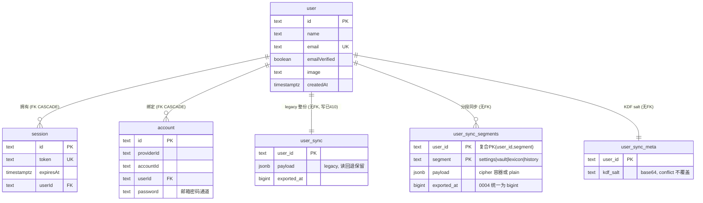
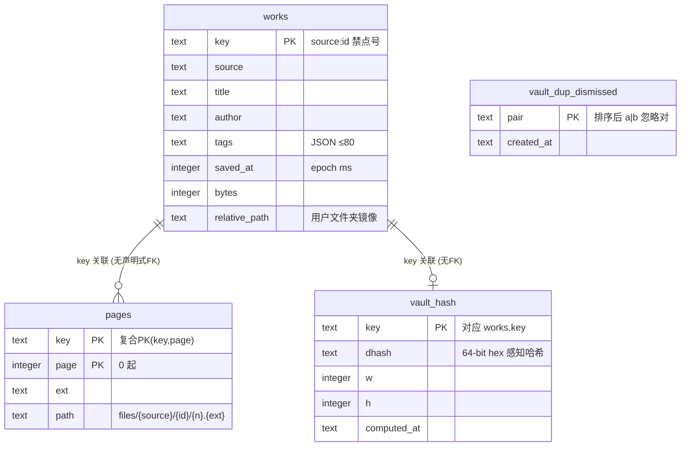
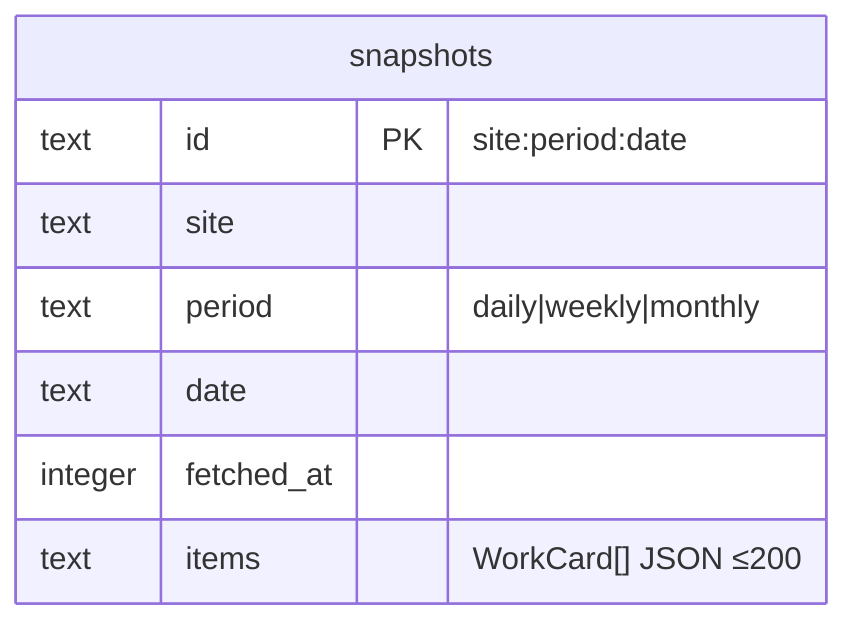

# 03 — 数据模型与数据库设计

> 基线 `main@f1991d7`（2026-09-22 校准，含 #126 迁移 0004；#136~#162 无库结构变化——浏览器端 kami-settings v13 增 uiStyle、lastBackupAt（只记本机）、authorAliases（≤200 条）、tagAliases（≤500 条，#155）、safeModeBySite（#162，每站点 R-18；旧全局 safeMode 广播迁移）字段，均随同步/备份往返）。吸收原 06-数据库设计说明 / ER图 / 17-备份与同步加密设计 / storage.md 精华（编号原件已删除；storage.md 保留为专题文档）。依据优先级：数据库实际结构（migrations/）> 迁移脚本 > 业务代码推导。

## 3.1 存储分型总览

四套并行存储，各得其所：

| 套 | 技术 | 存什么 | 位置 |
| --- | --- | --- | --- |
| A | Postgres / PGlite | 应用账号（better-auth 四表）+ 账号同步三表 | `DATABASE_URL` 或 PGlite 内存库 |
| B | `node:sqlite` ×2 | 收藏库（vault）、榜单归档（rankings） | `.data/vault/vault.sqlite`、`.data/rankings/rankings.sqlite` |
| C | 文件系统 | 媒体/列表缓存、PGlite 快照、密钥、收藏原图 | `.data/` |
| D | 浏览器 | IndexedDB ×2 + localStorage（键位清单见 3.3 E）+ sessionStorage | 客户端 |

**为什么图是文件、库只存字**（storage.md 精华）：原图以 jpg/png/gif 落盘不进 SQLite——任意看图软件可打开、备份 rsync 按作者归档是普通文件操作、库小搜索快、Pixiv 图链会过期不能只存 URL。**为什么不用图数据库**：作品/作者/标签概念上是图，但检索需求（按标题/作者/路径/tag）关系表足够；将来加 `work_tags`/`work_related` 边表即可，不必换引擎。

## 3.2 架构选择、迁移与快照

- **后端选择**：`DATABASE_URL` 非空 → Postgres（pg Pool，int8/date 类型对齐）；否则 PGlite **纯内存实例**（不用 dataDir——WASM 实例强杀可损坏目录，electric-sql/pglite#327），持久化由 JSON 快照承担。
- **迁移**（PGlite 在 `getSql()` 首次调用时执行；Neon 在 build 后 `scripts/migrate.mjs`，无连接跳过；`_migrations` 表按 basename 记账；**无 down 脚本**，回滚=代码回滚）：
  | 文件 | 内容 |
  | --- | --- |
  | `0001_auth.sql` | better-auth 四表（user/session/account/verification） |
  | `0002_user_sync.sql` | legacy 整份同步表（写路径已 410 关闭，读回退保留） |
  | `0003_user_sync_segments.sql` | 分段同步 user_sync_segments + user_sync_meta（kdf_salt） |
  | `0004_user_sync_exported_at_bigint.sql` | **TD-30 ✅**：`exported_at` text→bigint（USING 强转存量），SQL 级排序/比较恢复正确语义 |
  | `auth/` 子目录 | 「未开启登录不应用」的 opt-in 模板（两执行器都不递归子目录） |
- **快照**：public 全表动态枚举（除 _migrations）+ information_schema FK 拓扑排序恢复 + 逐行 on conflict do nothing；500ms 防抖 + 30s 看护 + 写后显式补偿；restore 失败行尾部重试一轮后**隔离落盘** `.data/kami-db-snapshot.restore-failed.json`（不再静默销毁）。
- **jsonb 列识别**：~~白名单硬编码~~ 已改 **information_schema 逐表枚举**（#144）——恢复时按各表实际 jsonb 列决定 `::jsonb` 转换；仅枚举失败时回退 `{"payload"}` 白名单并打 `[db-snapshot:jsonb]` 告警（现 schema 全部 jsonb 列同名 payload，回退不复现老病；新表若用别的 jsonb 列名，留意告警即可）。

## 3.3 表结构全量清单

### A. Postgres / PGlite

| 表 | 用途 | 主键 | 核心字段 | 关联 |
| --- | --- | --- | --- | --- |
| user | Better Auth 账号 | id text | name、email UNIQUE、emailVerified、image、createdAt/updatedAt | 1—N session/account（FK CASCADE） |
| session | 登录会话 | id text | token UNIQUE、expiresAt、ipAddress/userAgent、userId FK | → user |
| account | 凭据通道 | id text | providerId/accountId、password（邮箱密码）、OAuth 字段全 NULL 预留 | → user |
| verification | Better Auth 验证 | id text | identifier/value/expiresAt | 独立 |
| user_sync | **legacy** 整份同步（写 410 关闭） | user_id text | payload jsonb、exported_at bigint | 无 FK（应用层 scope） |
| user_sync_segments | **现行**四段同步 | (user_id, segment) 复合 | segment ∈ {settings,vault,lexicon,history}；payload jsonb（cipher 容器或 plain）；exported_at **bigint**（0004 统一） | 无 FK |
| user_sync_meta | KEK 派生 salt | user_id text | kdf_salt text（base64，on conflict 不覆盖——服务端固定） | 无 FK |
| _migrations | 迁移记账（代码建） | name text | applied_at | 独立 |

### B. SQLite vault（.data/vault/vault.sqlite，vault-store.server.ts）

| 表 | 用途 | 主键 | 核心字段 | 关联 |
| --- | --- | --- | --- | --- |
| works | 收藏条目元数据 | key text（`{source}:{id}`，禁点号防穿越） | title/author/author_id、tags JSON ≤80、page_count、saved_at（epoch ms）、bytes、relative_path/folder_label（用户文件夹镜像） | 1—N pages；1—0..1 vault_hash |
| pages | 每页文件指针 | (key, page) 复合（page 0 起） | ext/mime、bytes、path（相对 `files/{source}/{id}/{n}.{ext}`） | → works.key |
| vault_hash | dHash 感知哈希（#122） | key text | dhash（64-bit hex）、w/h、computed_at；解码失败**不落行**（覆盖率如实） | → works.key（无声明式 FK） |
| vault_dup_dismissed | 查重忽略对（人的决定） | pair text（排序后 `a\|b`） | created_at | 独立（候选组永不落库，现场重算） |

索引：works(source/author/saved_at)。写协议（TD-08 ✅）：tmp 暂存 → `BEGIN IMMEDIATE` 事务（删旧 pages/插新/upserset works）→ COMMIT → rename → 清未引用旧文件——崩溃安全论证在 vault-store.server.ts:202-300 注释。

### C. SQLite rankings（.data/rankings/rankings.sqlite）

**snapshots**：id text PK（`{site}:{period}:{date}`）、site/period/date、fetched_at、items（WorkCard[] JSON ≤200）。索引 (site,period,date)。**每 (site,period) 保留最近 KEEP_PERIODS 期**（TD-31 ✅ #126），更旧自动清理。

### D. 文件系统（.data/）

| 路径 | 结构 | TTL/清理 |
| --- | --- | --- |
| source/{sha256}.json | `{at, body}`（键=op 参数+safeMode/hideAi+账号 id/guest） | 30min，读时惰性删 |
| media/{sha256}.bin + .json | 字节 + `{type, at}` | 7 天；>8MB 拒存；部分域名排除 |
| kami-db-snapshot.json | `{at, tables:{表:行[]}}` 全量 | 防抖合并 + 30s 看护 |
| kami-db-snapshot.restore-failed.json | 恢复失败行隔离 | 人工处置 |
| vault/files/{source}/{id}/{n}.{ext} | 收藏原图（ugoira 合成失败时为 zip） | 永久（put 协议清未引用） |
| auth-secret.json / lan-token.json / proxy.json | 密钥/令牌/代理 | 永久 |

水位治理只覆盖 media/source（默认 2048/512MB 可配；每 50 写扫描，删至 80%）；vault 由用户收藏行为决定、rankings 有保留上限，均不再是无界项。

### E. 浏览器端

- IndexedDB `kami-vault` v2（meta: keyPath key + bySource/byAuthor/bySavedAt 索引；blobs: `{key}#{page}`）——纸匣预览镜像；IndexedDB `kami-folder`（FS Access DirectoryHandle）。
- localStorage：`kami-settings`(v13，含凭据——SEC-03 长期残余；v11 增 uiStyle #139、lastBackupAt #148（只记本机不进同步段）、authorAliases #151（≤200 条）、smartFolders/watchArtists/watchLimit 自 #151 起真正进同步段与备份——此前漏采白名单；v12 增 tagAliases #155（≤500 条、键值各 ≤120 字，标签别名归一层，随同步/备份往返）；**v13 增 safeModeBySite #162（五站各自 R-18 开关）；v14 增 watchTags #164（标签订阅 ≤30，随同步/备份往返）**)、`kami-queue`、`kami-history`(v2)、`kami-tag-lexicon`、`kami-tag-catalog`、`kami-browse-v2`(24h，键含凭据指纹 SEC-04)、`kami-account-sync-v2`、`kami-cred-dirty-v1`（脏标记）、watch 角标。
- sessionStorage：`kami-sync-kek`（raw KEK，不落盘）。

## 3.4 E-R 图

### 账号库（Postgres/PGlite）

### 收藏库（SQLite vault）

### 榜单库（独立）

**关系业务意义**：user→session/account 是 better-auth 标准三表（级联删除）；user_sync 系列无 FK 是有意为之——快照恢复需要灵活插入顺序（FK 拓扑排序在应用层做）；works→pages 的 key 复合关联支撑原子写协议；vault_hash 挂 works.key（解码失败无行 = 覆盖率如实）；vault_dup_dismissed 只持久化「人的决定」，候选组永远现场重算所以独立无关系；snapshots 纯归档。浏览器 IndexedDB 镜像与服务端 works **最终一致无冲突检测**（服务端覆盖本地）。

## 3.5 数据一致性机制

| 机制 | 位置 | 覆盖 |
| --- | --- | --- |
| UPSERT 幂等 | sync 三表 / snapshots / works | 重放安全 |
| 事务 | PGlite 迁移、vault `BEGIN IMMEDIATE`、Neon 迁移 | 应用查询无跨表事务需求；三库间无跨库事务（靠应用层协议） |
| 原子文件写 | tmp+rename（快照、auth secret、vault 页、隔离文件） | 崩溃安全 |
| LWW | 段粒度 exportedAt（bigint）比较 | **无版本向量/乐观锁**，时钟偏移风险（跨设备并发编辑同段可能丢更新） |
| 凭据守卫 | 无 KEK 不推密文 / 密文无 KEK 跳拉 / plain credsOmitted 保留 / 脏标记合并 | 防密文凭据被冲掉（四守卫族，单测锁字段集） |
| 防并发 | globalThis promise 槽、迁移链序列化 | HMR/并发请求 |
| 快照窗口 | 500ms 防抖 + 30s 看护 + 写后补偿 | 强杀最多丢 30s（Better Auth 内部写路径无补偿） |
| 失败隔离 | restore 失败行重试→隔离文件 | 不再静默销毁 |

**并发语义取舍**：单用户定位下 LWW + 无跨库事务是合理成本；多设备并发编辑是已知残余（见 05 号评估）。

## 3.6 数据库风险（当前口径）

| 项 | 状态 | 说明 |
| --- | --- | --- |
| ~~exported_at 类型不一致（TD-30）~~ | ✅ #126 迁移 0004 | text→bigint 强转存量 |
| ~~rankings/vault 磁盘无界（TD-31）~~ | ✅ #126 | rankings 保留上限；vault 有 /vault/stats 容量视图 |
| ~~快照 jsonb 白名单硬编码~~ | ✅ #144 | 改 information_schema 逐表枚举；仅枚举失败回退 `{"payload"}` 并告警 |
| user_sync 三表无 FK | 设计取舍 | 换取快照恢复灵活性，scope 靠 requireUserId |
| 多实例快照互踩（R-12） | 观察 | PGlite 快照 watch 是进程内的，多 worker 互覆【需要确认是否恒单进程】 |
| LWW 时钟偏移 | 已知取舍 | 跨设备并发编辑同段无向量钟 |
| N+1 / 慢 SQL | 不存在 | 无 ORM 关系查询；SQL 均走索引；列表分页在源站侧 |

## 3.7 凭据加密设计（原 17 号文档精华，两刀均已实施）

**目标**：凭据（图站会话、Danbooru key、代理密码）在「离开本机内存」的每个落点都是密文。

**加密原语**（src/lib/storage/crypto-box.ts）：PBKDF2-HMAC-SHA256 210,000 轮 + AES-256-GCM（口令错=解密失败，自带完整性）；WebCrypto 原生，Node/浏览器同构。

| 落点 | 对策 | 状态 |
| --- | --- | --- |
| 备份 JSON 外发 | v2 格式：`settingsCipher`（CipherBox 容器）替代 settings+proxyUrl 明文；不填口令仍 v1 明文，旧文件永远可直接导入 | ✅ |
| 服务端同步存储 | 四段分段（0003），settings 段 KEK 密文；KEK=PBKDF2(应用账号密码, user_sync_meta.kdf_salt)，raw key 仅 sessionStorage；登录瞬间（密码在手）派生→拉取解密→全量推送 | ✅ |
| legacy 整份明文写路径 | POST 无 segment 载荷 410 关闭（GET 读回退保留），不再产生明文落盘（SEC-14 ✅） | ✅ |
| localStorage kami-settings | 明文（含凭据）——**长期残余**：终局方案=凭据只存服务端 HttpOnly，触发条件=多设备成为常态 | 挂账（长期） |
| vault/词表/历史 | 不加密（非敏感目录性数据，明确不做） | — |
