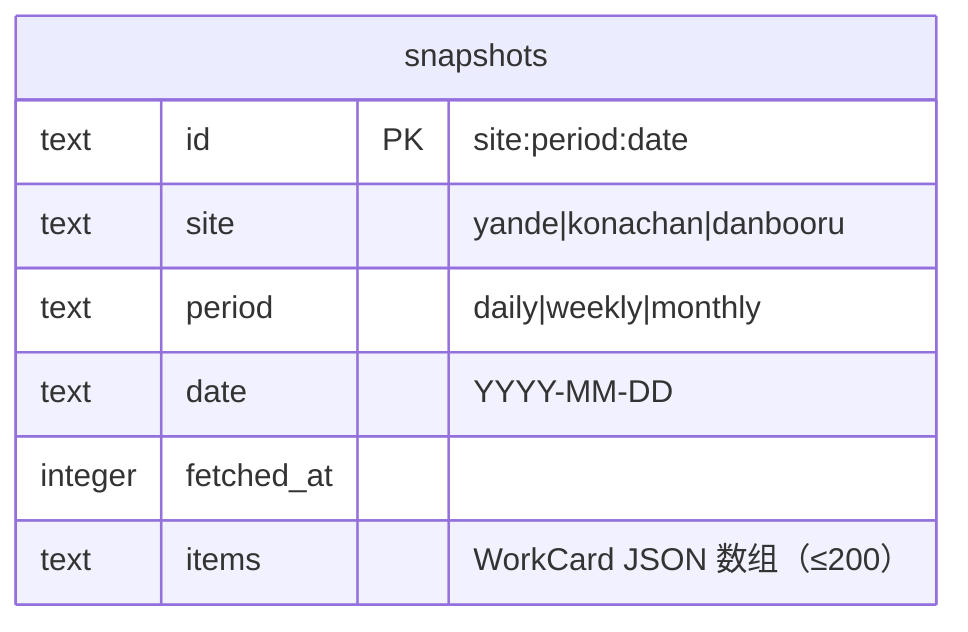
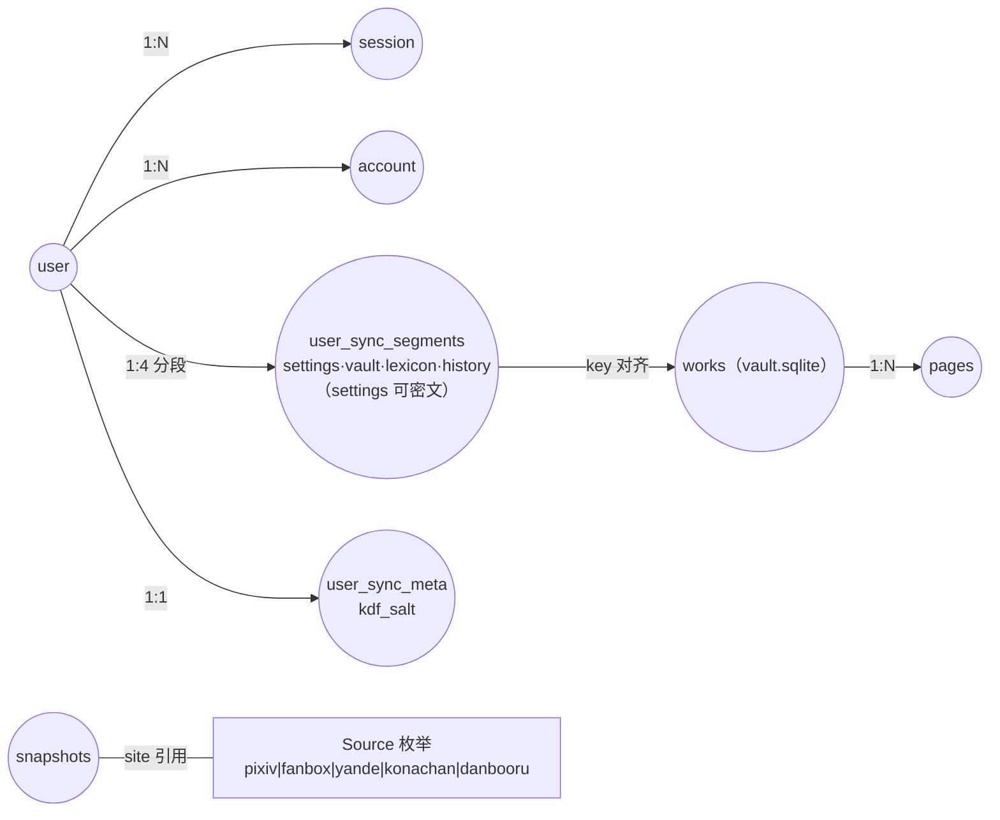

# E-R 图

**图的目的**：按真实表结构（migrations/*.sql 与 SQLite 建表语句）表达实体关系。表共 9 张，分三张图 + 一张全局简化图。
**涉及的模块**：M4（Postgres 表）、M7（vault SQLite）、M3/rankings（SQLite）。

## 图 1：应用账号体系（Postgres / PGlite / Neon 同构）

```mermaid
erDiagram
    user ||--o{ session : "登录会话（CASCADE）"
    user ||--o{ account : "认证方式（CASCADE）"
    user ||--|| user_sync : "旧单行同步（过渡期兼容读）"
    user ||--o{ user_sync_segments : "分段同步（四段 LWW）"
    user ||--|| user_sync_meta : "同步加密 KDF 盐"

    user {
        text id PK
        text name "NOT NULL"
        text email UK "NOT NULL UNIQUE"
        boolean emailVerified "NOT NULL"
        text image "头像，可空"
        timestamptz createdAt "DEFAULT now()"
        timestamptz updatedAt "NOT NULL"
    }
    session {
        text id PK
        text token UK "NOT NULL UNIQUE"
        timestamptz expiresAt "NOT NULL"
        text ipAddress "审计可空"
        text userAgent "审计可空"
        text userId FK "→ user.id"
        timestamptz createdAt
        timestamptz updatedAt
    }
    account {
        text id PK
        text providerId "credential（邮箱密码单通道）"
        text accountId "NOT NULL"
        text userId FK "→ user.id"
        text password "email/pwd 哈希"
        timestamptz createdAt
        timestamptz updatedAt
    }
    user_sync {
        text user_id PK "逻辑引用 user.id"
        jsonb payload "旧整份 BackupFile（过渡期）"
        bigint exported_at "LWW 比较基准（毫秒）"
        timestamptz updated_at "DEFAULT now()"
    }
    user_sync_segments {
        text user_id PK1 "复合PK之一"
        text segment PK2 "settings|vault|lexicon|history"
        jsonb payload "settings 段可为 CipherBox 密文"
        text exported_at "段级 LWW 基准（毫秒字符串）"
        timestamptz updated_at "DEFAULT now()"
    }
    user_sync_meta {
        text user_id PK "逻辑引用 user.id"
        text kdf_salt "KEK=PBKDF2(账号密码,salt)"
        timestamptz updated_at "DEFAULT now()"
    }
```

**关系业务意义**：一个 user 可有多个 session（多浏览器登录）与多个 account（平台退出后只剩 credential）；`user_sync_segments` 一人四行，是「换浏览器恢复」的载体（TD-09 分段 LWW：多设备不再整份互覆）——settings 段含图站凭据时以 CipherBox 密文落库（SEC-03：KEK 由账号密码派生，只存浏览器 sessionStorage）；`user_sync_meta.kdf_salt` 是密钥派生基准。**⚠ TD-19：segments/meta 两表不在 db-snapshot 的 TABLES 清单内，PGlite 形态重启即丢**（旧单行 user_sync 在快照内不受影响）。

## 图 2：纸匣目录（SQLite .data/vault/vault.sqlite）

```mermaid
erDiagram
    works ||--o{ pages : "key（应用层维护，无FK）"

    works {
        text key PK "格式 source:id"
        text source "NOT NULL"
        text id "NOT NULL"
        text title "NOT NULL"
        text author "NOT NULL"
        text author_id "DEFAULT ''"
        text tags "JSON数组，截80"
        integer page_count "NOT NULL"
        integer saved_at "NOT NULL（毫秒）"
        integer bytes "NOT NULL"
        text relative_path "用户文件夹相对路径"
        text folder_label
    }
    pages {
        text key PK1 "复合PK之一"
        integer page PK2 "复合PK之二"
        text ext "NOT NULL"
        text mime "NOT NULL"
        integer bytes "NOT NULL"
        text path "NOT NULL（相对 files/ 的文件路径）"
    }
```

**关系业务意义**：works 一行 = 一件作品；pages 一行 = 一页像素文件。put 采用「暂存 + 事务先行 + rename 原子替换」（TD-08 ✅）——任何时点崩溃，数据库始终自洽（要么整份旧、要么整份新），文件层最差个别页 miss（重新收入自愈）。**注意**：works 与浏览器侧 IDB meta（VaultMeta）与服务端目录是**冗余双记**，以 key 对齐；relative_path 指向用户文件夹的作品在服务端可能没有 pages 行（像素只在文件夹里）。

## 图 3：热榜快照（SQLite .data/rankings/rankings.sqlite）



独立实体，无关系（索引 idx_snap_site_period 支撑按站+周期查询）。

## 图 4：全局简化数据关系（含非 SQL 存储）



**图解与风险**：真正的 SQL 外键只有 session/account→user 两处；其余全是应用层逻辑关联（segments、pages、快照的 site）——单进程单写者下可控，但任何外部工具直接改库都可能破坏一致性（不建议绕过 API 改 .data 下任何库）。camelCase（auth 表）与 snake_case（user_sync 系、SQLite）混用是 Better Auth 官方 schema 所致（DQ-7）。**TD-19**：重启持久化只覆盖 user/account/session/user_sync 四表（kami-db-snapshot.json），segments/meta 靠应用层补救前不跨重启。
