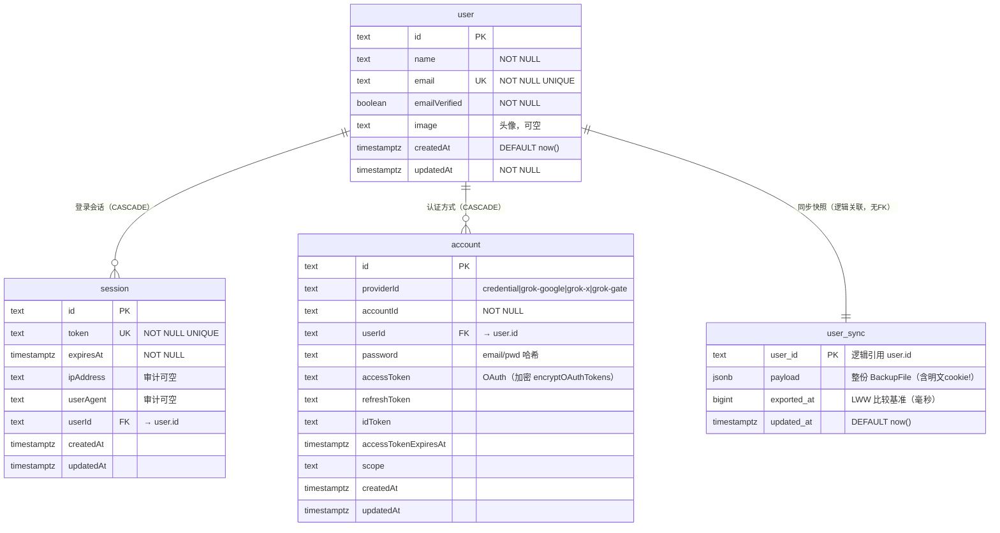
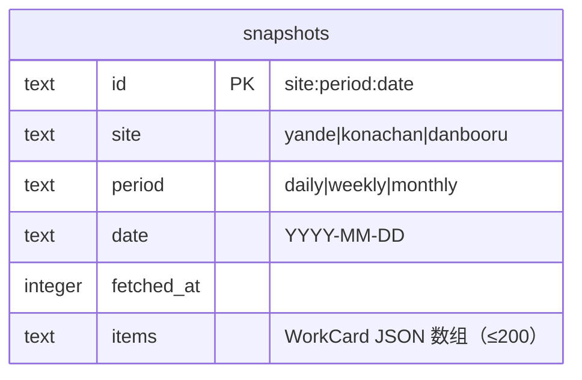
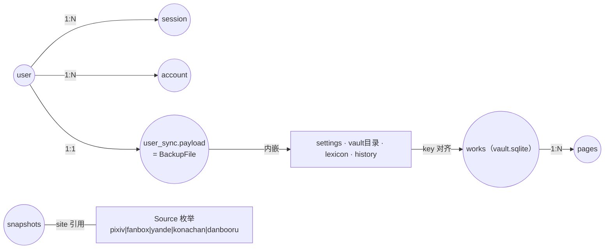

# E-R 图

**图的目的**：按真实表结构（migrations/*.sql 与 SQLite 建表语句）表达实体关系。表较少（7 张），分两张图 + 一张全局简化图。
**涉及的模块**：M4（Postgres 表）、M7（vault SQLite）、M3/rankings（SQLite）。

## 图 1：应用账号体系（Postgres / PGlite / Neon 同构）



**关系业务意义**：一个 user 可有多个 session（多浏览器登录）与多个 account（email+OAuth 并存）；user_sync 一人一行，是「换浏览器恢复」的载体——payload 含全部图站凭据（SEC-03）。

## 图 2：纸匣目录（SQLite .data/vault/vault.sqlite）

```mermaid
erDiagram
    works ||--o{ pages : "key（应用层维护，无FK）"

    works {
        text key PK "格式 source:id"
        text source "NOT NULL"
        text id "NOT NULL"
        text title "NOT NULL"
        text author "NOT NULL"
        text author_id "DEFAULT ''"
        text tags "JSON数组，截80"
        integer page_count "NOT NULL"
        integer saved_at "NOT NULL（毫秒）"
        integer bytes "NOT NULL"
        text relative_path "用户文件夹相对路径"
        text folder_label
    }
    pages {
        text key PK1 "复合PK之一"
        integer page PK2 "复合PK之二"
        text ext "NOT NULL"
        text mime "NOT NULL"
        integer bytes "NOT NULL"
        text path "NOT NULL（相对 files/ 的文件路径）"
    }
```

**关系业务意义**：works 一行 = 一件作品；pages 一行 = 一页像素文件。删除作品时先删 pages 行与 files/ 物理文件再删 works（put 先删后写，无事务——TD-08）。**注意**：works 与浏览器侧 IDB meta（VaultMeta）与服务端目录是**冗余双记**，以 key 对齐；relative_path 指向用户文件夹的作品在服务端可能没有 pages 行（像素只在文件夹里）。

## 图 3：热榜快照（SQLite .data/rankings/rankings.sqlite）



独立实体，无关系（索引 idx_snap_site_period 支撑按站+周期查询）。

## 图 4：全局简化数据关系（含非 SQL 存储）



**图解与风险**：真正的 SQL 外键只有 session/account→user 两处；其余全是应用层逻辑关联（user_sync、pages、快照的 site）——单进程单写者下可控，但任何外部工具直接改库都可能破坏一致性（不建议绕过 API 改 .data 下任何库）。camelCase（auth 表）与 snake_case（user_sync、SQLite）混用是 Better Auth 官方 schema 所致（DQ-7）。
