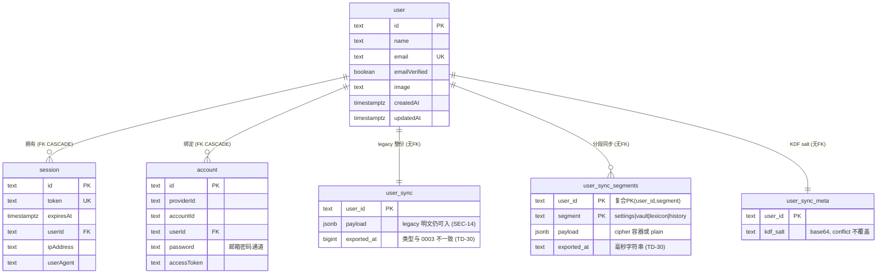
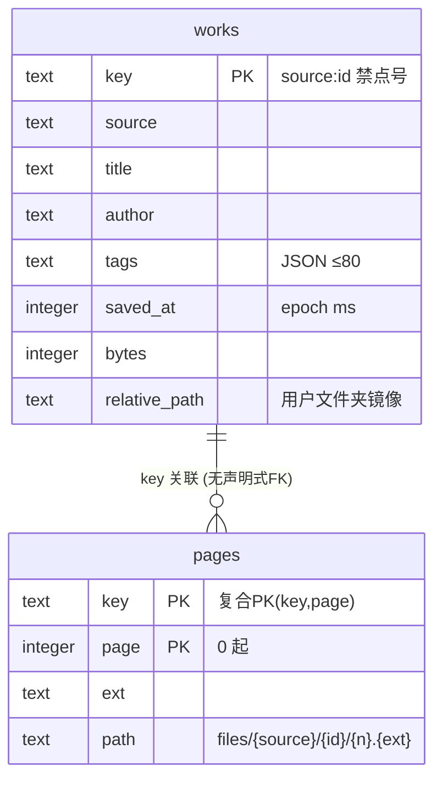
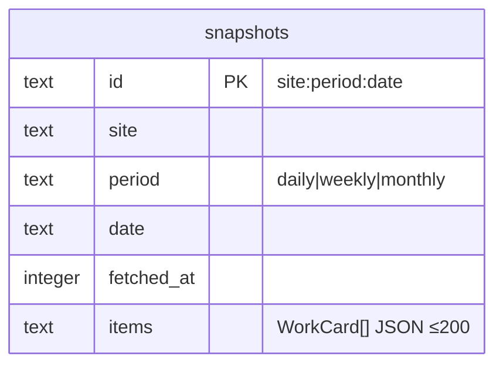
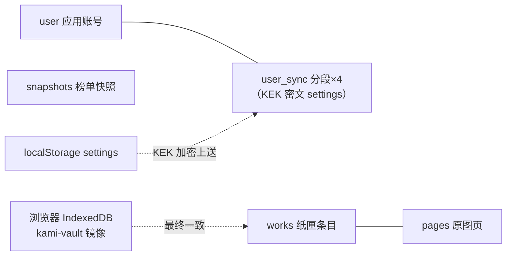

# E-R 图

- **目的**：全部持久化实体的关系与基数（PK/FK/核心字段）。
- **依据**：migrations/*.sql + vault-store.server.ts + ranking-store.server.ts（优先级：数据库实际结构 > Migration > 业务代码推导）。
- **基线**：`main@75e7de0`。

## 1. 账号库（Postgres/PGlite，migrations/）

## 2. 收藏库（SQLite，.data/vault/vault.sqlite）

## 3. 榜单库（SQLite，.data/rankings/rankings.sqlite）

## 4. 简化全局关系

**关系业务意义**：user→session/account 是 better-auth 标准三表（级联删除）；user_sync 系列无 FK 是有意为之——快照恢复需要灵活插入顺序（FK 拓扑排序在应用层做）；works→pages 的 key 复合关联支撑原子写协议；snapshots 独立无关系（纯归档）。

**风险点**：① user_sync 三表无 FK，scope 全靠 requireUserId（12 号）；② exported_at 两表类型不一致（TD-30）；③ vault 浏览器镜像与服务端最终一致无冲突检测（06 号 6.5）。
