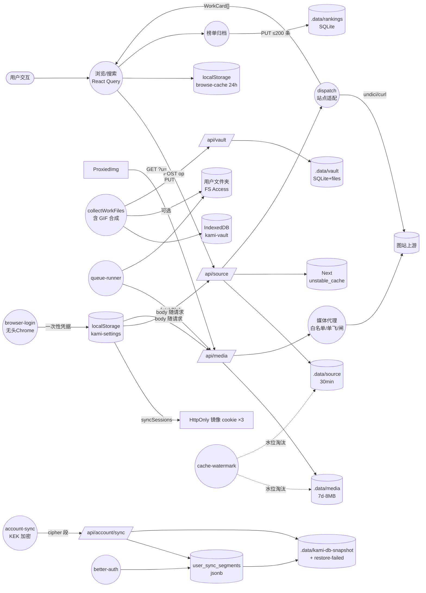

# 数据流图（DFD）

- **目的**：数据的源、汇、加工与存储位置（含凭据流向这一敏感面）。
- **涉及模块**：全部。
- **基线**：`main@75e7de0`。

**图解**：三条主数据流（列表、媒体、收藏）各自带多级存储；凭据流是第五条暗线——localStorage 明文（SEC-03 残余）→ 请求体 → HttpOnly 镜像 → KEK 密文段（服务端只见密文）。

**风险点**：① legacy 明文段仍可进 C8/SNAP（SEC-14）；② C5 上限 8MB 与回源 48MB 口径不一致（PER-8）；③ C4/C7 不参与水位（TD-31）；④ SNAP 多进程互踩无防护（R-12）。
