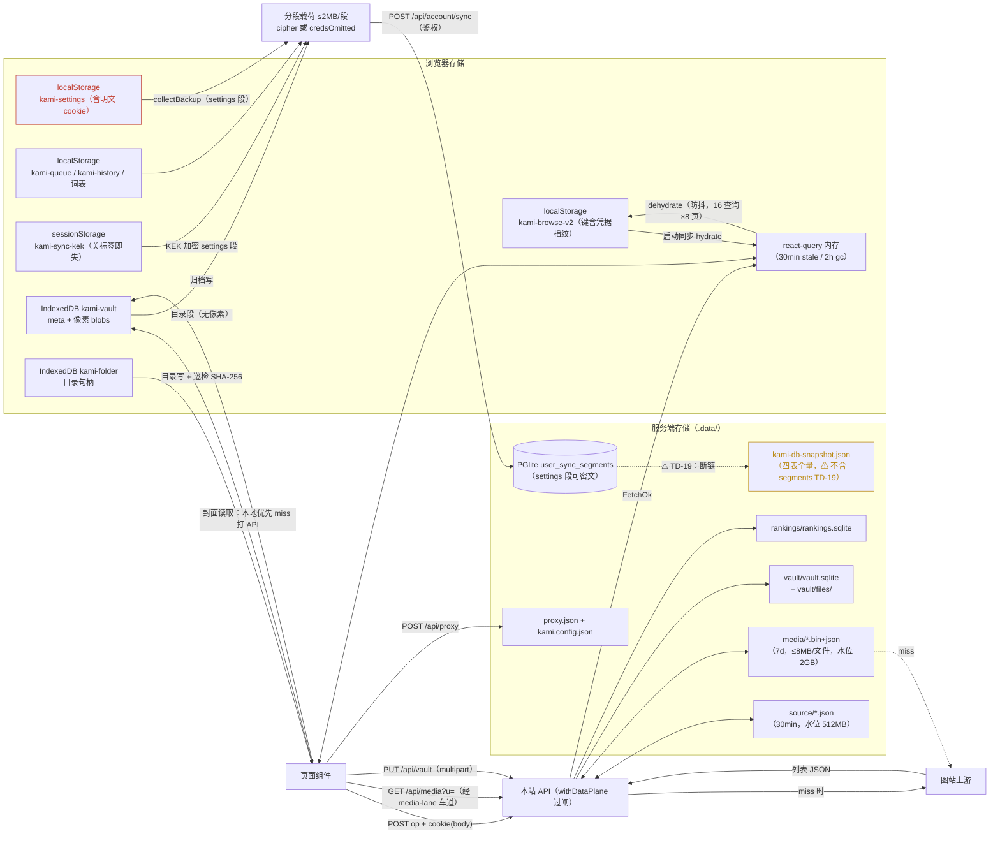

# 数据流图（DFD）

**图的目的**：追踪三类核心数据（列表 JSON、图像像素、凭据）在存储之间的流动与落点。
**涉及的模块**：M1/M2/M3/M5/M7/M8 与各存储。2026-09-11 复核：凭据流已加密化（SEC-03/04 ✅），标红仅剩 localStorage 明文残余。

**图解说明（2026-09-11 复核）**

- **列表数据**走「上游 → API → 盘缓存 → react-query → localStorage」单向流，每层有独立 TTL（30min/1800s/30min/24h）；browse 缓存键与 react-query 键均含**凭据指纹**（不可逆，SEC-04 ✅——旧的带 Cookie 原文的 v1 存储读到即删）。
- **像素数据**只在归档时进 IDB/磁盘；浏览态像素始终由 `/api/media` 代理（浏览器 HTTP 缓存 7d immutable），浏览器侧经 media-lane 4 条车道限并发。
- **凭据流**（SEC-03 ✅ 后）：localStorage `kami-settings` 仍是明文（标红，长期残余）；离开浏览器后全程密文——settings 段以 KEK（PBKDF2(账号密码, 服务端 salt)，只存 sessionStorage）加密落 user_sync_segments；备份导出可选口令加密（v2）。
- 橙色标出的 `dbsnap` 断链是 **TD-19**：分段表数据不会进快照，PGlite 形态重启即丢。

**风险点 / 注意事项**：`kami-settings` 明文是 XSS/本机进程攻击面（单机信任模型下接受，长期方案收敛到服务端 HttpOnly）；TD-19 修复前，重启后靠「有变更的浏览器重新推送分段」自愈。
