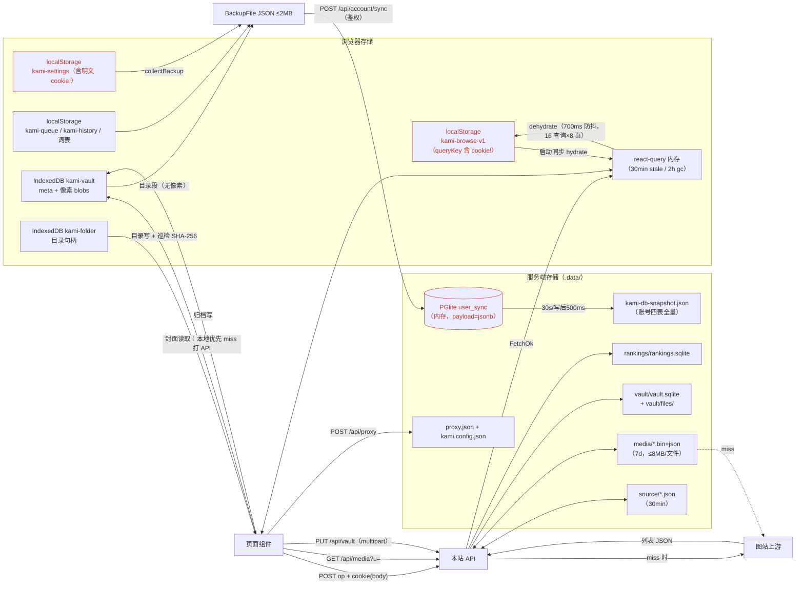

# 数据流图（DFD）

**图的目的**：追踪三类核心数据（列表 JSON、图像像素、凭据）在存储之间的流动与落点。
**涉及的模块**：M1/M2/M3/M5/M7/M8 与各存储。

**图解说明**

- **列表数据**走「上游 → API → 盘缓存 → react-query → localStorage」单向流，每层有独立 TTL（30min/1800s/30min/24h）。
- **像素数据**只在归档时进 IDB/磁盘；浏览态像素始终由 `/api/media` 代理（浏览器 HTTP 缓存 7d immutable）。
- 红色标出的三个节点是**凭据明文落点**（kami-settings、kami-browse-v1 的 queryKey、user_sync.payload）——SEC-03/04 的数据流证据。

**风险点 / 注意事项**：`kami-browse-v1` 会让已删除账号的 cookie 在 localStorage 残留至 24h 过期；备份导出（syncjson 落地文件）与 user_sync 同构，泄露面等同（12 文档）。
