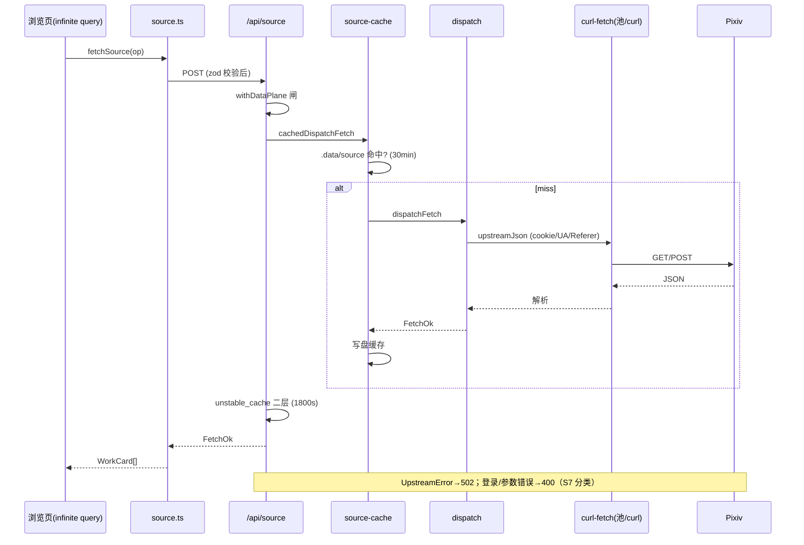
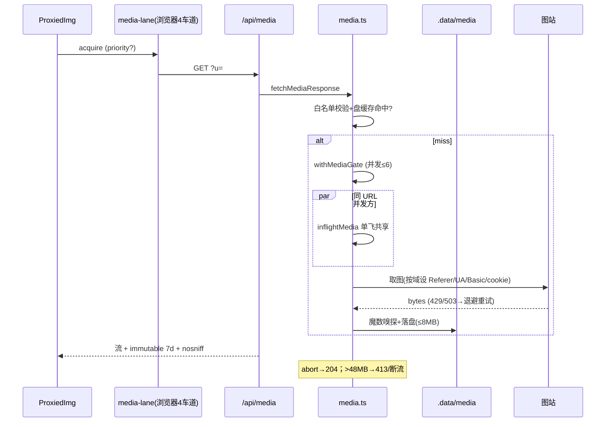
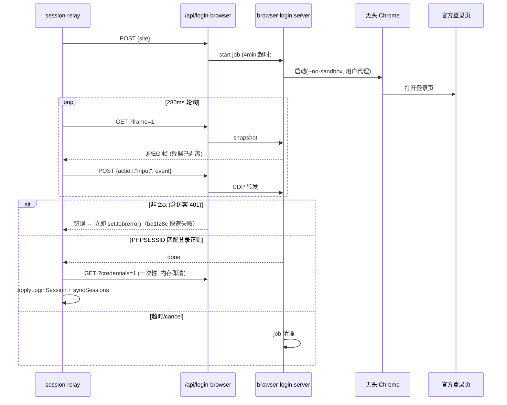
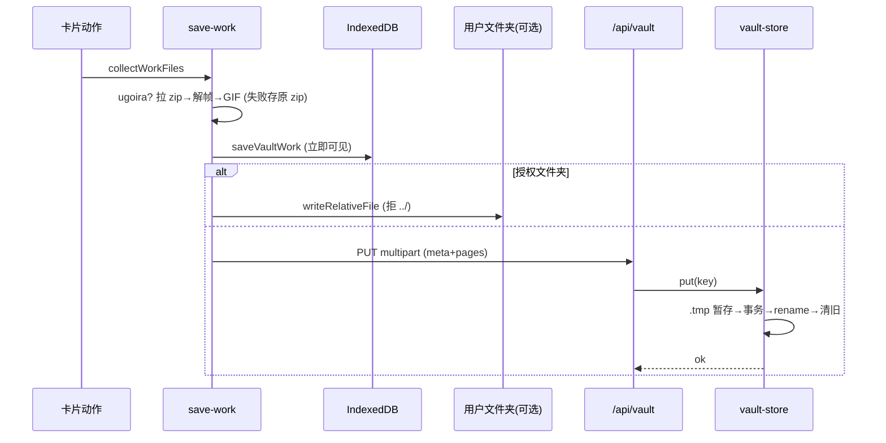
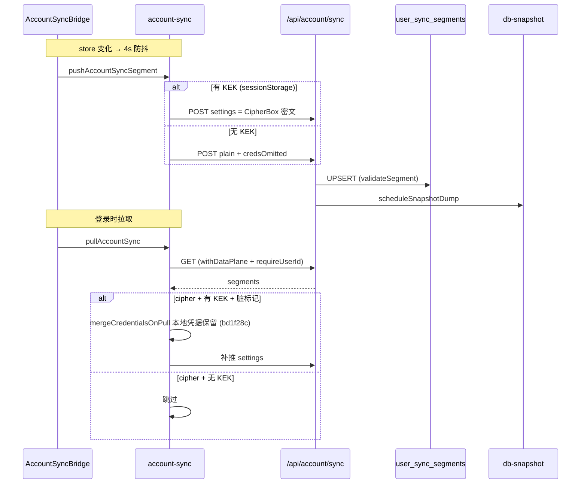

# 时序图（关键链路）

- **目的**：五条最关键链路的真实调用时序（谁调谁、返回什么、异常怎么传）。
- **基线**：`main@75e7de0`（含 bd1f28c）。

## 1. 浏览取数（缓存穿透链）

## 2. 媒体代理（单飞 + 闸）

## 3. 登录中转（bd1f28c 后）

## 4. 收入纸匣（浏览器→文件夹→服务端）

## 5. 账号同步（推送/拉取，bd1f28c 后）

