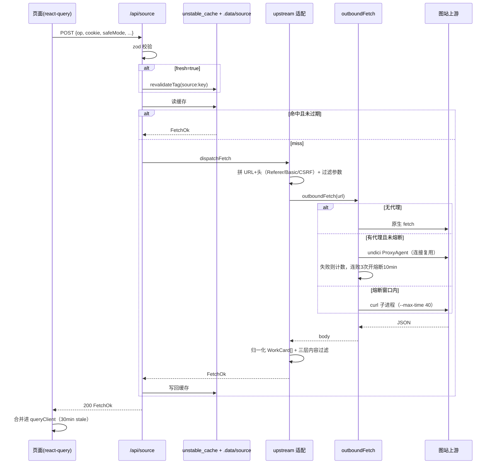
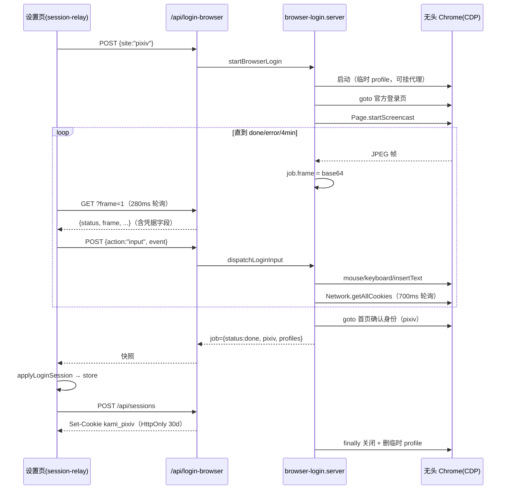
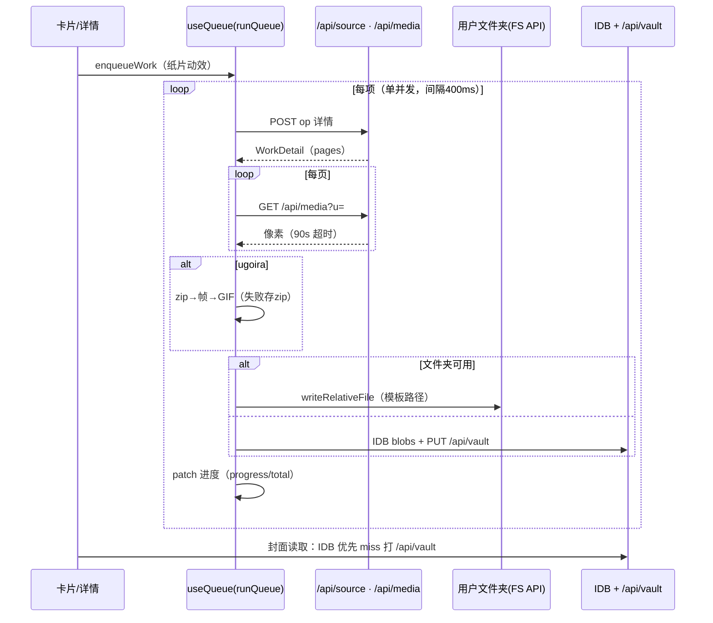
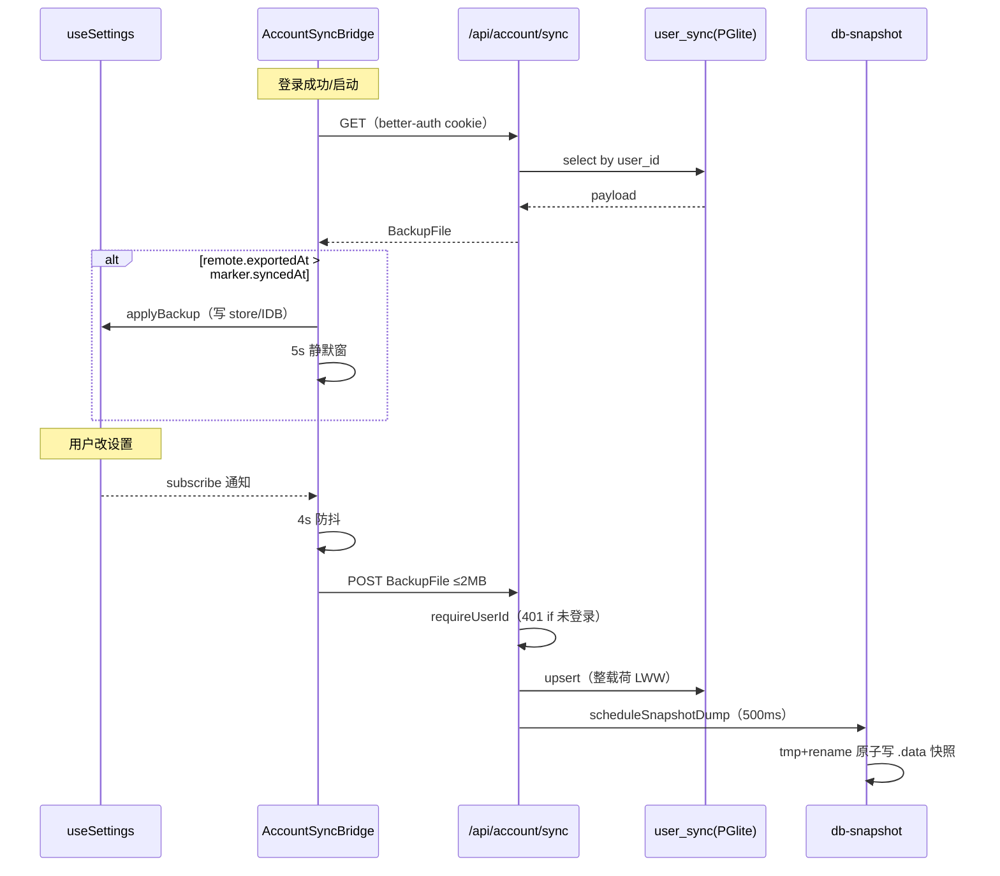

# 时序图（Sequence Diagrams）

**图的目的**：四个需要精确到消息顺序的场景。**涉及的模块**：M1-M7。

## 图 1：浏览请求全链（含缓存与代理熔断）

## 图 2：登录中转（puppeteer 投屏）

## 图 3：入队归档（串行队列）

## 图 4：应用账号同步（推/拉）

**图解与风险**：图 2 的轮询响应携带凭据明文（SEC-02）；图 4 的整载荷 LWW 在多设备并发时后写覆盖先写（TD-09）；图 1 的熔断状态是进程内的，重启即清零。
