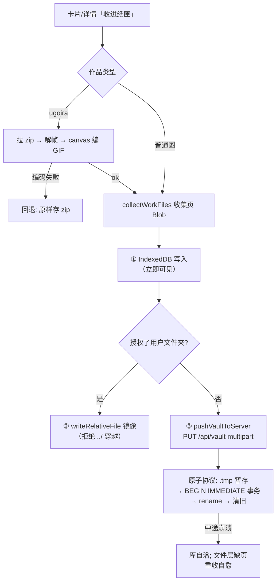
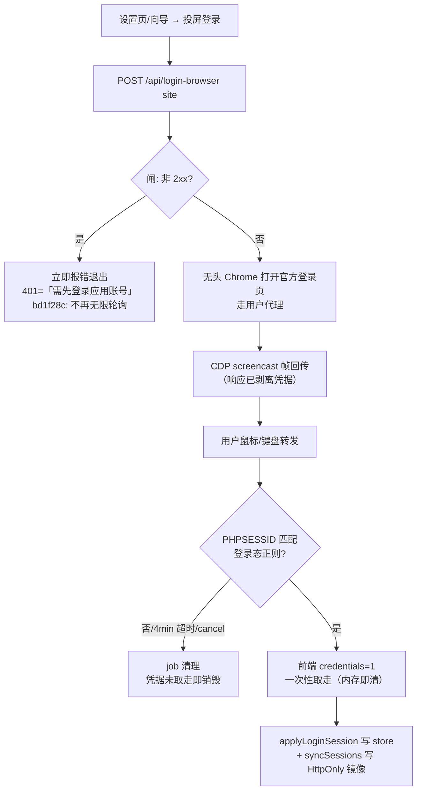
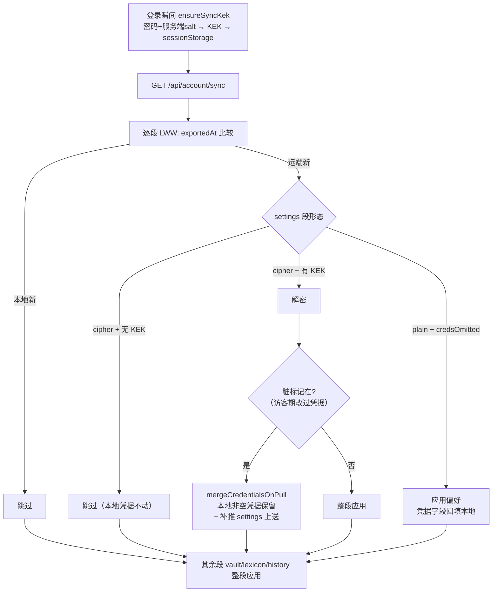

# 核心业务流程图

- **目的**：四大核心流程的控制流全貌，**含异常分支**（不是 Happy Path 汇报）。
- **涉及模块**：source-cache / upstream / media / save-work / vault-store / queue-runner / browser-login / account-sync。
- **基线**：`main@75e7de0`（含 bd1f28c）。

## 1. 浏览取数（含 Pixiv 日榜未公布窗口回落）

```mermaid
flowchart TB
  A[进入页面/切站/翻页] --> B{水合门 hydrated?}
  B -- 否 --> Z1[等待 persist 水合<br>query 暂不启用]
  B -- 是 --> C[POST /api/source<br>键=op参数+safeMode+hideAi+凭据指纹]
  C --> D{Next unstable_cache 命中?}
  D -- 是 --> E[返回]
  D -- 否 --> F{.data/source 盘缓存<br>30min 内?}
  F -- 是 --> E
  F -- 否 --> G[dispatchFetch → 站点适配]
  G --> H{需要登录的 feed<br>且无凭据?}
  H -- 是 --> X1[400 用户态错误<br>UI Alert 提示]
  H -- 否 --> I[出站: undici 池 / curl 降级]
  I --> J{上游响应}
  J -- 非 2xx/解析失败 --> X2[UpstreamError → 502]
  J -- ok --> K{Pixiv 日榜带日期?}
  K -- 「未公布窗口」404/空列表 --> K1[回落昨天] --> K2{仍失败?}
  K2 -- 是 --> K3[无日期请求] --> L
  K2 -- 否 --> L[映射 WorkCard[]]
  K -- 否/历史 404 --> X2
  L --> M[过滤: safeMode/hideAi/BLOCKED_TAGS]
  M --> N[写盘缓存 + Next 缓存 + 榜单快照PUT<br>（仅 booru 第一页）]
  N --> O[返回; 浏览缓存 localStorage 24h]
```

## 2. 收入纸匣（ugoira 合成失败回退 + 三级落盘）



## 3. 图站登录中转（bd1f28c 后含快速失败）



## 4. 账号同步拉取（bd1f28c 后含凭据保留合并）



**图解与风险点**：见 04 号业务流程说明各节；关键异常语义——502/400 二分、未公布窗口三级回落、原子协议崩溃安全、凭据四守卫。
