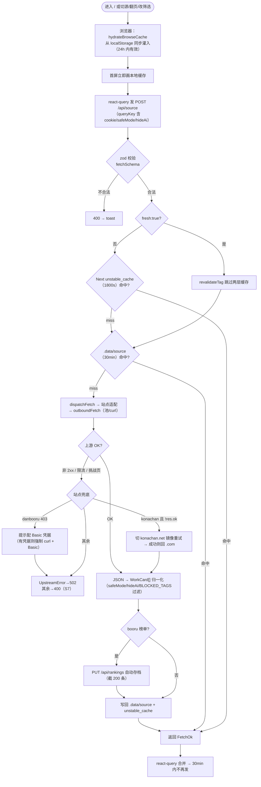
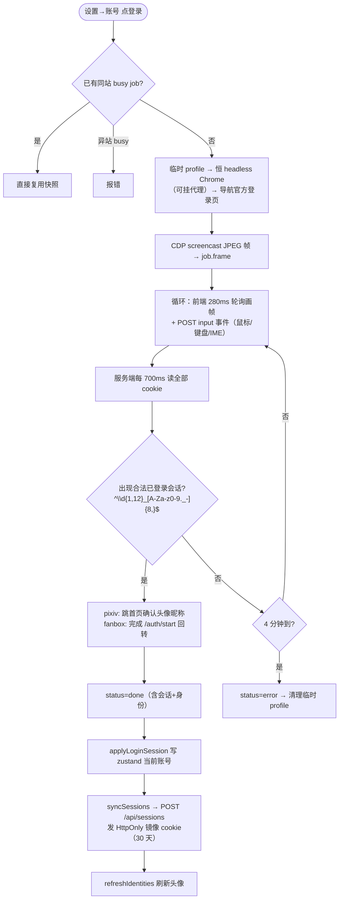
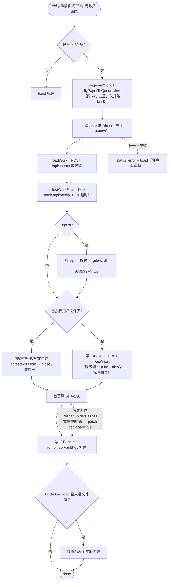

# 核心业务流程图

**图的目的**：三个最关键流程的完整分支（含异常），对应 04 文档 FP-1/FP-2/FP-3。
**涉及的模块**：M1/M2/M3（浏览）、M6/M5（登录）、M7（归档）。

## 图 1：浏览信息流（FP-1，三层缓存）

**图解（2026-09-11 复核）**：异常分支覆盖了 400、上游失败、Konachan 镜像（200+HTML 挑战页也回退，TD-11 ✅）、Danbooru Cloudflare 四条路径；缓存命中路径完全不打上游。~~翻页启发式误判末页（TD-12）~~ ✅ 已改用过滤前原始条数判断。

## 图 2：图站登录中转（FP-2）

**图解**：单例互斥是单用户假设的体现；「合法格式」过滤掉了访客令牌。轮询与快照端点均已过数据面访问闸（SEC-02 ✅）。**风险**：headless 反检测参数可能随 Chrome 升级失效（R-01 一类）。

## 图 3：下载 / 收入纸匣（FP-3）

**图解（2026-09-11 复核）**：用户文件夹是第一优先落点，应用内目录只是兜底；SHA-256 巡检是事后一致性手段。服务端 vault 写已原子化（暂存+事务先行+rename，TD-08 ✅）；文件夹写走 FS Access createWritable（本身原子）。**剩余风险**：失败无自动重试、无跨标签页共享（M6 待做）；~~进度回写全列表重渲染（PER-2）~~ ✅ 200ms 节流。
