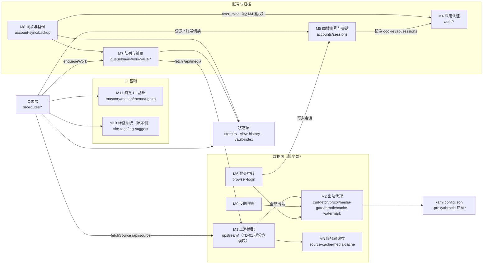

# 模块关系图

**图的目的**：以 05 文档的 11 个模块为节点，表达模块间依赖方向与耦合热点。
**涉及的模块**：M1 上游适配、M2 出站代理、M3 服务端缓存、M4 应用认证、M5 图站账号、M6 登录中转、M7 队列与纸匣、M8 同步与备份、M9 反搜、M10 标签系统、M11 UI 基础设施，加页面层与状态层。

**图解说明（2026-09-11 复核）**

- **M2 是全局枢纽**：M1/M6/M9 的所有出站都经过它，代理与熔断只需一处实现（架构最佳决策）。
- **M1 是最大汇聚点**：页面层、M7（取详情）、M9（缩略图）都依赖它——TD-01 拆分后耦合热点已按站点分散（pixiv 413 / fanbox 332 / booru-sites 267 行），并有固定样本回归测试守映射。
- M5 与 M4 只在「镜像 cookie」处弱关联：图站账号体系与应用账号体系基本独立；数据面统一经 M4 的 withDataPlane 访问闸（页面 → M1/M3/M7 的所有 API 边都过闸）。
- M8 依赖 M7 的目录数据（分段 vault 段），但只读目录不碰像素；settings 段凭据以密文形态过 M4。
- 状态层（zustand）被 M7/M8/页面三方读写，是客户端的事实「共享内存」。

**风险点 / 注意事项**：图上任何指向 M1 的新边都应克制（新功能优先复用既有 op）；M2 的配置热载意味着改 kami.config.json 立即影响运行中进程——测试环境与生产同机时要小心。
