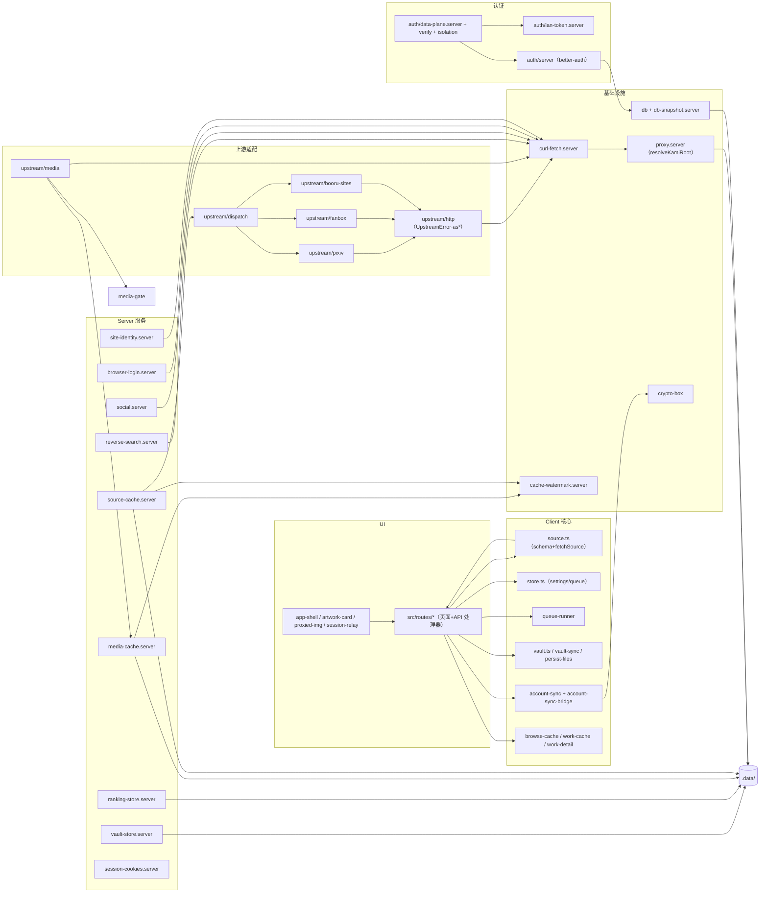

# 模块关系图

- **目的**：src/lib 平铺模块的真实依赖聚类与方向，用于判断改动波及面。
- **涉及模块**：src/lib 全部 + src/routes + src/components 枢纽。
- **基线**：`main@75e7de0`。仅画主干依赖（省略 ui/* 基件、纯展示组件）。

**图解**：三个高扇入枢纽——`curl-fetch.server`（所有出站的物理层）、`proxy.server`（resolveKamiRoot 是全部 .data 落盘的定位基准）、`source.ts`（浏览器侧唯一数据入口）。上游适配层闭环在 upstream/ 内；认证层独立成岛只被 API 层消费。

**风险点**：① 平铺无目录边界，横向新依赖零阻力（无 lint 边界，16 号 M10）；② as* 工具在 7 个模块各自复制（TD-32）；③ `upstream/http.ts` 若被客户端误引会带出 server 依赖——目前靠 `.server.ts` 命名 + db 运行时抛错双保险，无编译期隔离。
