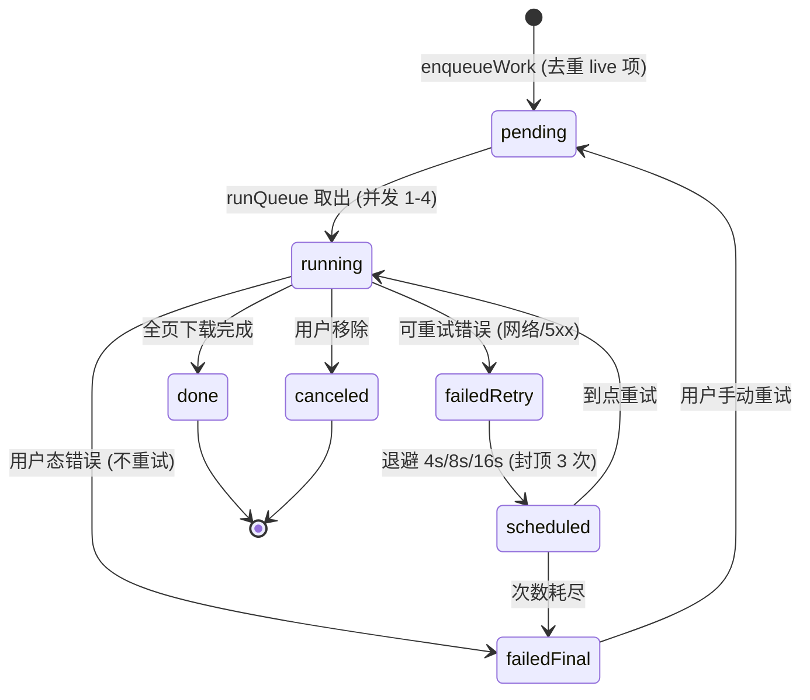
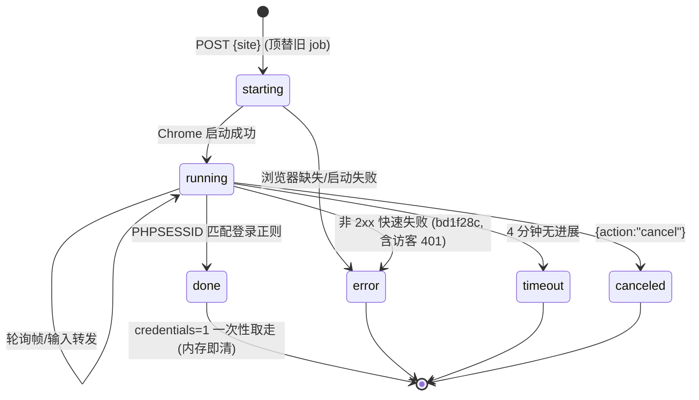
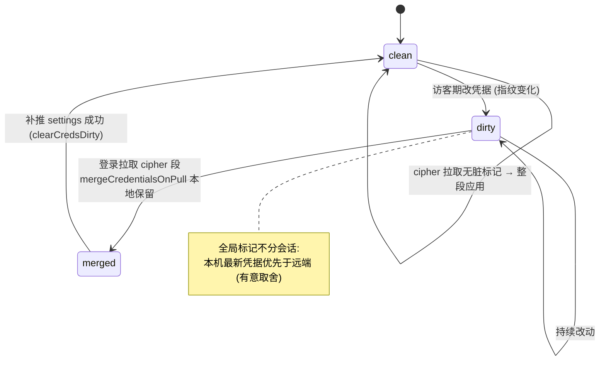

# 状态图（State Diagrams）

- **目的**：有明显生命周期的三类对象：下载队列项、登录中转 job、同步凭据脏标记。
- **基线**：`main@75e7de0`（含 bd1f28c）。

## 1. 队列项（queue-runner + queue-retry，浏览器侧）

注：状态存 zustand persist（kami-queue，≤80 条只存状态不存 Blob）；跨标签由 Web Locks 保证单执行者 + BroadcastChannel 镜像。

## 2. 登录中转 job（browser-login.server，进程内单例）

## 3. 同步凭据脏标记（bd1f28c 新增，localStorage kami-cred-dirty-v1）

**图解**：三个状态机的共同设计取向——终态要么可恢复（failedFinal→手动重试）、要么可清理（凭据随 job 销毁）、要么自愈（脏标记推完即清）。

**风险点**：① 队列 persist 不存 Blob，重载后需重拉（设计取舍）；② 登录 job 单例互顶——并发开两个中转后者顶替前者【基于源码推导】；③ 脏标记跨设备并发不设防（LWW 时钟偏移，R-04）。
