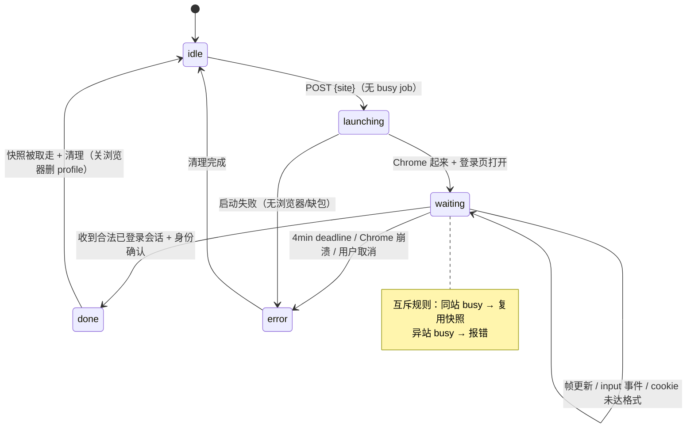
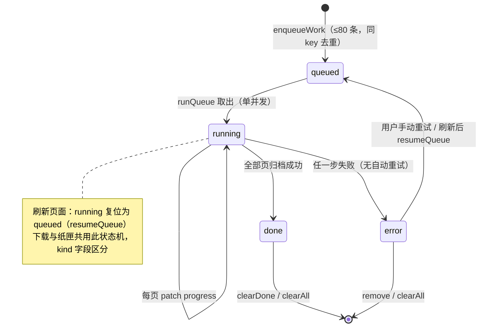
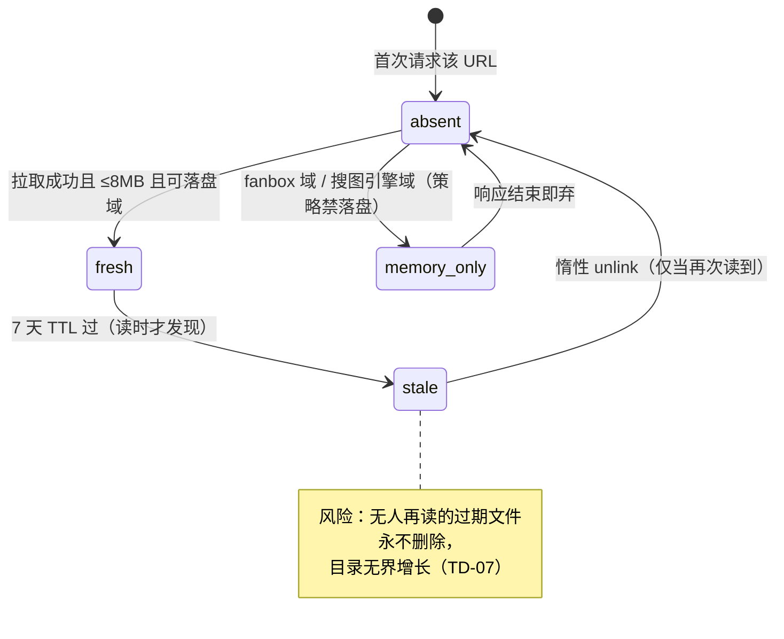

# 状态图（State Diagrams）

**图的目的**：三个有明确生命周期的对象。**涉及的模块**：M6（登录任务）、M7（队列项）、M3（媒体缓存条目）。

## 图 1：登录中转任务（browser-login 单例）

## 图 2：队列项（QueueItem，localStorage kami-queue）

## 图 3：媒体缓存条目（.data/media）

**图解说明**：三个状态机都由**单用户低并发**前提简化——登录任务全局单例、队列单并发、缓存惰性清理，都不需要处理竞态；一旦做多用户/多标签并发（长期路线），图 1 和图 2 的互斥语义需要重新设计（参考 16 文档触发条件）。

**风险点**：图 2 的 error→queued 依赖用户手动介入，长批量下载中一个失败不阻塞后续项（串行循环继续），但也不会自动补跑失败项。
