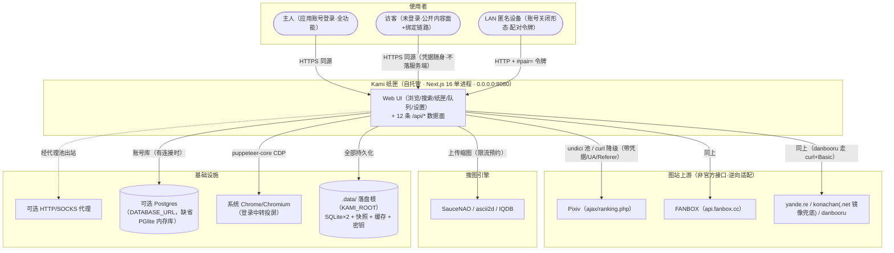

# 系统上下文图（System Context Diagram）

- **目的**：一眼看清系统边界——谁用它、它依赖哪些外部系统、数据从哪来到哪去。
- **涉及模块**：整体（app/ + src/），不展开内部结构（那是架构图的职责）。
- **基线**：`main@75e7de0`。

**图解**：三类使用者走同一入口；一切上游访问由服务端代劳（凭据/代理/反爬收敛在服务端）；持久化全部落在 KAMI_ROOT 的 `.data/`（或外接 Postgres）。访客与 LAN 形态的差异只在数据面闸的放行策略（12 号文档）。

**风险点**：① 上游全部是非官方接口，反爬升级即断（R-01）；② 默认绑 0.0.0.0，威胁模型必须包含不可信 LAN 设备（12 号）；③ 登录中转依赖系统浏览器存在；④ PGlite 形态的持久化依赖快照文件（强杀丢 0.5-30s 窗口）。
