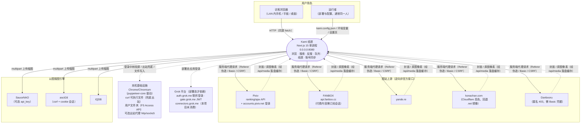

# 系统上下文图（System Context Diagram）

**图的目的**：界定系统边界——谁是外部实体、数据从哪来到哪去、哪些依赖不可控。
**涉及的模块**：整个 Kami 纸匣进程（作为单一系统单元）与其全部外部实体。

**图解说明**

- 浏览器**只与 Kami 纸匣通信**，从不直连图站——代理、防盗链、Cloudflare、凭据四类问题被整体移到服务端解决，这是系统存在的核心理由。
- 图站与搜图引擎都是**不可控上游**（逆向接口，随时可能改版/加固，见风险 R-01）。
- 虚线是「环境依赖」而非业务数据流：Chrome、curl、用户文件夹、代理都是本机资源，缺失时对应功能降级（登录中转不可用 / 兜底失效 / 镜像降级应用内目录）。
- Grok 平台仅在部署态参与登录；本机形态（当前主形态）完全不依赖它。

**风险点 / 注意事项**：系统默认监听 `0.0.0.0`，图中「访客浏览器」实际上可以是**局域网内任何设备**——安全评估（12 文档）的全部高危问题都源于这个边界的信任假设。
