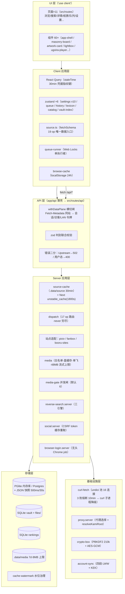

# 系统架构图（分层视图）

- **目的**：展示进程内分层与每层的核心构件、层间调用方向。
- **涉及模块**：app/、src/routes、src/lib 全域。
- **基线**：`main@75e7de0`。

**图解**：依赖方向总体单向向下（UI→Client→API→Server→Storage/Infra）。三个横切件贯穿：withDataPlane（安全）、三层缓存（性能）、crypto-box（凭据）。薄壳层 app/ 只做 re-export，真实实现全在 src/routes 与 src/lib。

**风险点**：① AppShell（L1 壳）反向 import 首页实现，破坏了单向性（PER-13）；② L4 内 source-cache 与 unstable_cache 双层记账（TD-27）；③ L5 三库无跨库事务，一致性靠应用层协议（06 号）。
