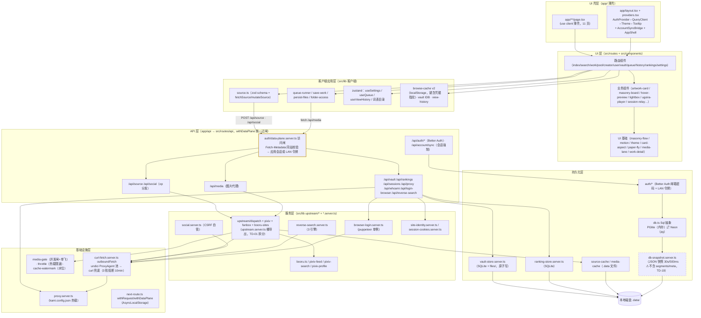

# 系统架构图（分层视图）

**图的目的**：展示进程内部分层与调用方向，定位每层职责与「访问闸」位置。
**涉及的模块**：app 薄壳层、src/routes、components、lib 各层、持久化、外部出站。
**2026-09-11 复核**：数据面 10 路由已统一过 `withDataPlane` 访问闸（SEC-01 ✅）；upstream 已拆分为六模块（TD-01 ✅）。

**图解说明**

- **`dp`（数据面访问闸）横切全部数据面 API**（2026-09-10 起）：每个 Route Handler 被 `withDataPlane` 包装——先 Fetch-Metadata 同站校验（跨站 scripted 请求 403），再要求应用账号会话（authConfigured 时）或 LAN 启动令牌（关闭态三通道：Authorization 头 / `?token=` / 配对 cookie）。`/api/account/sync` 在闸内再强制 Better Auth 会话。
- `request_ctx` 横切全部 API 层：Route Handler 被 `withRequest` 包装后，Request 进入 AsyncLocalStorage，认证与 cookie 读取不依赖参数传递。
- 持久化四轨并行：SQL 轨（账号/同步）、SQLite 轨×2（纸匣/热榜）、文件轨（缓存/快照）——各自独立，无统一 Repository。
- PGlite 是内存库，进程重启即空，靠 `snapshot` 落 `.data/kami-db-snapshot.json` 恢复（user/account/session/user_sync 四表 + `.data/auth-secret.json` 签名密钥）；**TD-19**：user_sync_segments/user_sync_meta 不在清单内。
- 浏览器侧另有 `media-lane`（4 条图片加载车道，详情首图插队），与服务端 media-gate 构成两层并发闸。

**风险点 / 注意事项**：~~upstream 单文件瓶颈（TD-01）~~ 已拆分；`media_api` 直接深达 upstream（不经 gateway 的 op 分发），新增出站逻辑时注意不要绕开统一校验；新增数据面端点必须走 `withDataPlane`（09 指南）。
