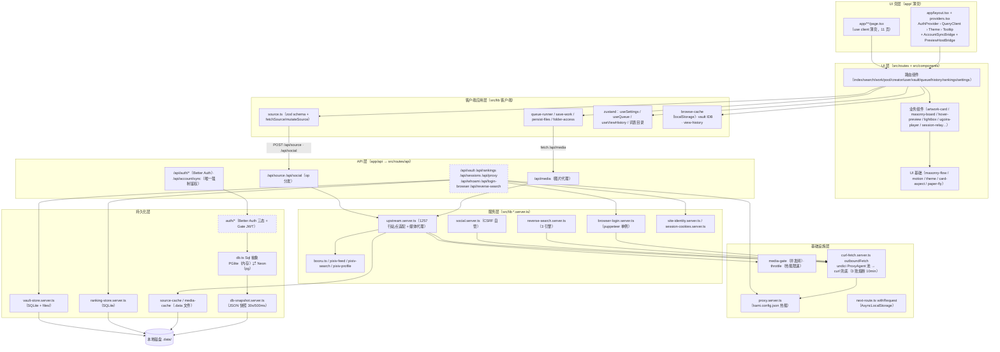

# 系统架构图（分层视图）

**图的目的**：展示进程内部分层与调用方向，定位每层职责与「鉴权断点」。
**涉及的模块**：app 薄壳层、src/routes、components、lib 各层、持久化、外部出站。

**图解说明**

- 实线为主数据流；`gateway` 与 `data_api` 之间的差异值得注意：**除 `/api/account/sync` 外，data_api 一组（虚线框）均无鉴权**——authz 模块（虚线）已实现 `runAuth` 但未接入任何 data_api 端点（SEC-01）。
- `request_ctx` 横切全部 API 层：Route Handler 被 `withRequest` 包装后，Request 进入 AsyncLocalStorage，认证与 cookie 读取不依赖参数传递。
- 持久化四轨并行：SQL 轨（账号/同步）、SQLite 轨×2（纸匣/热榜）、文件轨（缓存/快照）——各自独立，无统一 Repository。
- PGlite 是内存库，进程重启即空，靠 `snapshot` 落 `.data/kami-db-snapshot.json` 恢复。

**风险点 / 注意事项**：上游适配集中在 `upstream.server.ts` 单文件（图中 service 层最大节点），是演进的主要瓶颈（TD-01）；`media_api` 直接深达 `upstream`（不经 gateway），新增出站逻辑时容易绕开统一校验。
