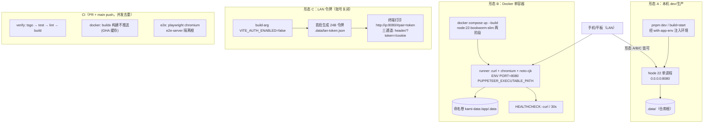

# 部署架构图

- **目的**：三种运行形态 + CI 流水线的物理视图。
- **基线**：`main@75e7de0`。

**图解**：三形态共享同一个 `.data/` 语义（KAMI_ROOT 解析）；Docker 是唯一自带浏览器与字体的形态；LAN 令牌形态只是把数据面闸从「应用会话」换成「配对令牌」，其余不变。CI 三 job 见 08 号 8.4。

**风险点**：① e2e 本地复用已存 server 时隔离失效（TD-26）；② `.dockerignore` 未排除 kami.config.json（SEC-15）；③ 无专用健康端点（用 `/`）；④ Vercel 形态已实质废弃但 `.vercel/` 残留（16 号长期「部署形态收敛」）。
