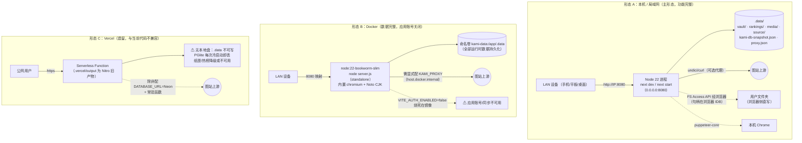

# 部署架构图

**图的目的**：三种部署形态的进程/数据/网络拓扑对比。**涉及的模块**：全部运行时模块 + Docker/Vercel 基础设施。

**图解说明**

- **形态 A** 是唯一功能完整的形态：用户文件夹直写依赖「浏览器与文件夹在同一台机器」（FS Access API 特性），这是把归档放客户端的架构前提。
- **形态 B** 数据齐全（kami-data 卷）但镜像构建参数关闭了应用账号（TD-17）；容器内出网必须显式配代理，且代理地址要用 `host.docker.internal` 指回宿主。
- **形态 C** 是历史残留：`.vercel/output` 的 framework 字段还是 nitro（2026-08-31，早于 Next 迁移）。当前代码若上 Vercel，serverless 的无盘/冷启动假设与「PGlite+JSON 快照+SQLite 文件」的持久化设计正面冲突——要么配 Neon + 常驻，要么放弃该形态（16 文档长期路线）。

**风险点 / 注意事项**：三形态的能力差异（应用账号、文件夹镜像、登录中转依赖的 Chrome）从未在 README 中对齐（TD-17/S8）；形态 A 的 LAN 暴露是 SEC-01 系列风险的物理前提，若在宿舍/公司等共享网络运行，短期修复（S1 令牌）完成前建议改绑 127.0.0.1。
