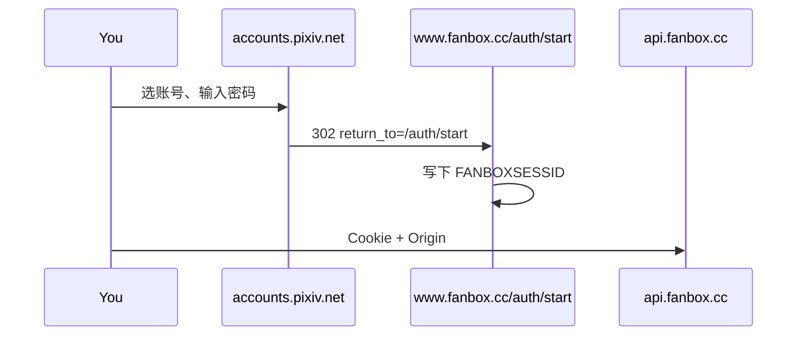

# 怎么读上游站点

纸匣不接官方开放平台。Pixiv、FANBOX 也没有给第三方用的公开 API 文档。页面上看到的榜单、推荐、投稿，全部是网站自己的 XHR。纸匣做的事就是：**跟着官方页面走一遍，把浏览器已经在用的那几条请求记下来，原样复打。**

**动手步骤**（DevTools 点哪里、无头 Chrome 怎么拦、curl 怎么复打、Cookie 怎么认）见 [reverse-engineering.md](reverse-engineering.md)。Pixiv 网页 Cookie / App OAuth / 开放平台三条认证线见 [pixiv-auth.md](pixiv-auth.md)。下面这份是纸匣已经在用的接口清单。

密码不经过纸匣。登录只发生在 `accounts.pixiv.net` / `www.fanbox.cc`。纸匣要的是登录之后浏览器里留下的会话 Cookie，以及之后那些 JSON 接口。

本项目只备份你已经有权查看的内容，不破解、不绕过付费墙。

---

## 1. 原则

1. **页面是说明书。** 不要先猜 URL。先在官方站点完成一次「我想做的操作」，再看网络面板里多了哪几条请求。
2. **只抄网站自己用的接口。** `/ajax/…`、`api.fanbox.cc/…`、`ranking.php?format=json` 都是网页前端打的，不是私有破解通道。
3. **Cookie 和请求头比路径更重要。** 同一条 URL，少 `Origin`、少 `x-userid`、或拿了访客 Cookie，就会 401 / 403。最近 FANBOX 的 401 就是这个。
4. **状态码是老师。** 200 且 JSON 里有 `body`，这条能用。401 先查会话。403 先查 Referer / Origin / User-Agent。空 `body` 或 `error: true` 再看字段名是不是改了。
5. **先最小复现，再写进纸匣。** 用「复制为 cURL」在终端打通，再搬到 `upstream.server.ts`。

---

## 2. 实际怎么操作

用桌面 Chrome 或 Edge，登录你自己的账号。不要用无痕（Cookie 对不上）。

### 2.1 把接口抓出来

1. 打开 [pixiv.net](https://www.pixiv.net) 或 [fanbox.cc](https://www.fanbox.cc)，F12 → **Network**。
2. 勾选 **Fetch/XHR**，清掉旧记录。
3. 做一次操作：打开日榜、搜标签、点进作品、点红心、切到 FANBOX 动态。
4. 列表里会出现 `/ajax/…` 或 `api.fanbox.cc/…`。点进去看：
   - **Request URL**、方法（GET / POST）
   - **Request Headers**：`Cookie`、`Referer`、`Origin`、`User-Agent`、`x-userid`、`x-csrf-token`
   - **Query / Payload**
   - **Response**：是不是 JSON，顶层是 `error` + `body` 还是别的
5. 右键该请求 → **Copy** → **Copy as cURL**。去掉浏览器特有的一堆头，留下网站真正检查的那几个，重新发一次。通了再写代码。

过滤关键词很有用：`ajax`、`illust`、`user`、`post.list`、`creator.get`。图片地址（`i.pximg.net`）不是接口，是媒体；纸匣走 `/api/media` 代理，并带上 Pixiv 的 Referer。

### 2.2 把 Cookie 认出来

F12 → **Application**（有的版本叫「存储」）→ Cookies。

| 站点 | 名字 | 已登录长什么样 | 访客长什么样 |
| --- | --- | --- | --- |
| Pixiv | `PHPSESSID` | `{用户数字ID}_{一长串令牌}`，例如 `12345678_abcdef…` | 没有下划线的随机串。登录页一打开就会发 |
| FANBOX | `FANBOXSESSID` | 通常和 Pixiv 的 `PHPSESSID` **同一个值** | 同样是一串无下划线的访客令牌 |

HttpOnly 的 Cookie，页面里的 JS 读不到，书签脚本也读不到。所以纸匣有两条路：

- **手贴**：从 Application 面板、Cookie-Editor 导出 JSON，或 Netscape `cookies.txt` 粘进设置。
- **登录中转**：后端用 Chrome 打开官方登录页，画面送到设置窗口里。你在官方页登录。登完用 Chrome DevTools Protocol 的 `Network.getAllCookies` 把会话收回来。

辨认逻辑在 `src/lib/browser-login.ts`：`/^\d{2,12}_[A-Za-z0-9]{16,}$/`。不符合的一律当访客，不保存。之前「没弹窗却抓到 Cookie、头像没有、全是 401」就是把登录页的访客 `PHPSESSID` 当成已登录。

### 2.3 从 HTML 里兜底读资料

有的接口要登录才给名字和头像。页面 HTML 里往往已经嵌了同一份数据：

- Pixiv：`#meta-global-data` 的 JSON，或 `userData` / `pixiv.user.id`
- FANBOX：页面里的 `"userId"` / `"iconUrl"`

`src/lib/site-identity.ts` 会先打 `touch/ajax/user/self/status`、`api.fanbox.cc/user.info`，失败再 parse HTML。登录中转里也会直接读当前页的 `page.content()`。

### 2.4 用失败反推缺了什么

| 现象 | 多半是 |
| --- | --- |
| 刚点登录就「成功」，没有头像用户名，后续 401/403 | 访客 Cookie |
| Pixiv 通、FANBOX 全 401 | 只打开了 `fanbox.cc` 首页，没有走 `/auth/start`；或请求没带 `Origin: https://www.fanbox.cc` |
| 图片裂开、媒体 403 | 缺 `Referer: https://www.pixiv.net/`（pximg 会查这个） |
| 收藏 / 红心失败 | 缺 CSRF：要从 `www.pixiv.net` HTML 里抠 `"token"`，放到 `x-csrf-token` |
| 登录窗口你看不见 | Chrome 开在服务器上。现在改成把官方页画面中转到设置里 |

---

## 3. Pixiv

Pixiv 网页是 SPA。公开数据走老的 `ranking.php?format=json`，个人数据走 `/ajax/…`。Cookie 是 `PHPSESSID`。已登录时再加请求头 `x-userid: {数字ID}`（ID 就从 Cookie 下划线前面取）。

统一头：

```
User-Agent: Mozilla/5.0 …
Cookie: PHPSESSID={用户ID}_{令牌}
Referer: https://www.pixiv.net/
x-userid: {用户ID}          # 已登录才加
Accept: application/json
```

代码：`src/lib/upstream.server.ts` 的 `upstreamJson(..., { origin: "pixiv" })`。

### 读

| 纸匣在做什么 | 网站自己打的地址 |
| --- | --- |
| 日 / 周 / 月榜 | `GET /ranking.php?mode={mode}&content=illust&p={page}&format=json` |
| 搜索 | `GET /ajax/search/artworks/{词}?word={词}&order=date_d\|date\|popular_d&mode=safe\|all\|r18&p={页}&s_mode=s_tag\|s_tag_full\|s_tc&type=all\|illust\|manga\|ugoira&lang=zh`，可选 `scd=YYYY-MM-DD`、`blt={收藏下限}`、`ratio=0.5\|-0.5\|0`、`ai_type=1` |
| 搜索联想 | `GET /ajax/search/suggest?word={词}&lang=zh`，空则 `GET /rpc/cps.php?keyword={词}&lang=zh` |
| 为你推荐 | `GET /ajax/discovery/artworks?mode=safe\|all&limit=60&lang=zh` |
| 关注动态 | `GET /ajax/follow_latest/illust?mode=safe\|all&p={页}&lang=zh` |
| 作品 | `GET /ajax/illust/{id}?lang=zh` 以及 `/ajax/illust/{id}/pages?lang=zh` |
| 相关作品 | `GET /ajax/illust/{id}/recommend/init?limit=18&lang=zh` |
| 画师 | `GET /ajax/user/{id}?full=1`、`/ajax/user/{id}/profile/all`、`/ajax/user/{id}/profile/illusts` |
| 动图 | `GET /ajax/illust/{id}/ugoira_meta?lang=zh` |
| 我是谁 | `GET /touch/ajax/user/self/status`，失败就读首页 HTML |

`mode=safe` 对应纸匣关掉 R-18。过滤 AI 时搜索会加 `ai_type=1`，列表里再看 `aiType === 2`。

返回几乎都是：

```json
{ "error": false, "message": "", "body": { } }
```

`error: true` 就当 Cookie 失效或参数不对。榜单 JSON 比较老，作品在 `contents[]`，字段是 `illust_id` / `user_name`。

### 写（红心 / 收藏 / 关注）

这些是 POST，网站会带 CSRF。纸匣先 GET `https://www.pixiv.net/`，从 HTML 里找 `"token":"…"` 或 `pixiv.context.token`，再放到 `x-csrf-token`。代码：`src/lib/social.server.ts`。

| 操作 | 地址 | 要点 |
| --- | --- | --- |
| 红心 | `POST /ajax/illusts/bookmarks/add` 再附带 `/ajax/illusts/like` | Pixiv 页面上的♡是收藏；いいね只加计数。JSON `{ illust_id, restrict: 0, tags }` |
| 收藏 | `POST /ajax/illusts/bookmarks/add` | JSON，`restrict: 0`，tags 用作品标签 |
| 取消收藏 | `POST /ajax/illusts/bookmarks/delete` | `{ bookmarkIds: […] }` |
| 关注 | `POST /bookmark_add.php` | 表单 `mode=add&type=user&user_id=` |
| 取关 | `POST /rpc_group_setting.php` | 表单 `mode=del&type=bookuser&id[]=` |

原图在 `i.pximg.net`。必须带 Pixiv Referer，否则 CDN 直接 403。纸匣不把原图链暴露给浏览器，一律走 `/api/media?u=…`。

登录页：

```
https://accounts.pixiv.net/login?return_to=https%3A%2F%2Fwww.pixiv.net%2F&source=pc&view_type=page
```

等到 `PHPSESSID` 变成 `数字ID_令牌`，再去 `www.pixiv.net` 读资料。不要在登录页一出现 Cookie 就收工。

---

## 4. FANBOX

FANBOX 的 JSON 在独立域名 `api.fanbox.cc`，页面在 `www.fanbox.cc` 和 `{creator}.fanbox.cc`。浏览器能打过去，是因为带了：

```
Origin: https://www.fanbox.cc
Referer: https://www.fanbox.cc/
Cookie: FANBOXSESSID={用户ID}_{令牌}; PHPSESSID={同一份}
```

少 `Origin` 或只拿访客 `FANBOXSESSID`，就会 401。这就是「Pixiv 好了、FANBOX 不行」时最先查的两件事。

### 登录必须回转

FANBOX 没有自己的账号体系。登录是 Pixiv 账号，再跳回 FANBOX 换会话：



官方入口（设置里「登录 FANBOX」现在就打开这个）：

```
https://accounts.pixiv.net/login?prompt=select_account&return_to=https%3A%2F%2Fwww.fanbox.cc%2Fauth%2Fstart&source=fanbox
```

只打开 `https://www.fanbox.cc/` 或 `/login` 不够。首页会先发访客 `FANBOXSESSID`，看起来像登录成功，打 `user.info` / `post.listHome` 全 401。必须等到回转到 `/auth/start` 之后，Cookie 变成 `用户ID_令牌`。

Pixiv 和 FANBOX 常常共用同一串会话。纸匣在没有合格 `FANBOXSESSID` 时，会用已登录的 `PHPSESSID` 去填。实现：`fanboxCookieHeader(fanbox, pixiv)`。

### 读

| 纸匣在做什么 | 地址 |
| --- | --- |
| 创作者 | `GET https://api.fanbox.cc/creator.get?creatorId=` |
| 创作者投稿 | `GET https://api.fanbox.cc/post.listCreator?creatorId=&limit=10&sort=newest` 翻页用 `firstPublishedDatetime` + `firstId` |
| 投稿 | `GET https://api.fanbox.cc/post.info?postId=` |
| 动态 | `GET https://api.fanbox.cc/post.listHome?limit=10` |
| 已支持 | `GET https://api.fanbox.cc/post.listSupporting?limit=10` |
| 标签 | `GET https://api.fanbox.cc/post.listTagged?tag=&limit=20` |
| 我是谁 | `GET https://api.fanbox.cc/user.info` |

JSON 也是 `{ body: … }`。投稿若 `isRestricted: true`，说明要付费 / 加入计划，纸匣只显示封面和提示，不把锁住的文件拉下来。

### 写

`POST https://api.fanbox.cc/{path}`，表单编码：

- 点赞 `like.create`　`postId`
- 关注 `follow.create` / `follow.delete`　`creatorId`

媒体在 `downloads.fanbox.cc` 等，代理时同样带 FANBOX 的 Origin / Referer / Cookie。

---

## 5. 图站和搜图

这几个有相对稳定的公开接口，不必登录。

| 站 | 怎么抓的 | 纸匣怎么打 |
| --- | --- | --- |
| Yande / Konachan | 站点自己的 `/post.json` | `https://yande.re/post.json?tags=&page=`；联想 ` /tag.json?name={词}*&order=count` |
| Danbooru | 文档化的 REST | `https://danbooru.donmai.us/posts.json`；联想 `/autocomplete.json?search[query]=` |
| SauceNAO / IQDB / TinEye | 搜图页的表单和结果 HTML | 上传走服务端，解析结果里的 pixiv / 图站链接 |

图站仍然过滤涉及未成年人的标签，R-18 默认关掉。这些规则在 `src/lib/booru.ts`，和「抓接口」是分开的一层。

---

## 6. 请求怎么出得去

浏览器不能直接打 `www.pixiv.net/ajax/…`：跨域、Cookie、还有 pximg 的 Referer 检查。所以：

1. 界面只跟纸匣自己的服务说话（`fetchSource` / `mutateSource` / `/api/whoami` / `/api/media`）。
2. 服务端用 `outboundFetch`（必要时走 curl）带上 Cookie 和头，去打上游。
3. 设置里的代理（`kami.config.json` / `KAMI_PROXY`）对上游和登录中转都生效。
4. 媒体 URL 白名单：`pximg.net`、`fanbox.cc`、图站、搜图站。别的地址拒绝。

登录中转是同一思路的另一面：官方页跑在后端的 Chrome 里，画面和点击中转到你眼前，Cookie 用 CDP 读，不经过「页面 JS 读 Cookie」这条走不通的路。

---

## 7. 代码落点

| 文件 | 干什么 |
| --- | --- |
| `src/lib/upstream.server.ts` | 上面那些读接口、JSON → 卡片 / 作品 |
| `src/lib/social.server.ts` | 红心、收藏、关注；Pixiv CSRF |
| `src/lib/site-identity.ts` | 从 JSON / HTML 抠用户名和头像 |
| `src/lib/site-identity.server.ts` | whoami：self/status、user.info |
| `src/lib/browser-login.ts` | Cookie 格式、访客过滤、FANBOX 登录 URL |
| `src/lib/browser-login.server.ts` | 打开官方页、中转画面、CDP 收 Cookie、回转 `/auth/start` |
| `src/lib/curl-fetch.server.ts` | 真正把请求打出去（含代理） |
| `src/routes/api/media.ts` | 图片代理 |
| `src/lib/booru.ts` | 图站 URL 和字段 |

改上游时优先改这些文件，并补 `src/lib/*.test.ts` 里对 JSON 形状的解析测试。不要把 Cookie 写进仓库或日志。

---

## 8. 接口改了怎么办

Pixiv / FANBOX 会改字段名、加 Cloudflare、换登录回跳。没有订阅通知。发现列表空了或又 401 时：

1. 用你自己的号在官方站点把同一操作做一遍。
2. Network 里对比：URL 变了？还是头变了？还是 JSON 路径变了（`body.illustManga.data` 这类）？
3. 先改解析，尽量兼容新旧字段（代码里已经有 `userId ?? user_id` 这种写法）。
4. 登录类问题先看 Cookie 是不是 `数字ID_令牌`，FANBOX 是不是经过 `/auth/start`。
5. 不要用打码、验证码识别或自动化去撞登录。走官方页，让人自己登。

上游不是纸匣的产品表面，随时会变。这份清单以仓库当前实现为准；页面和 Network 永远比这份文件新。
